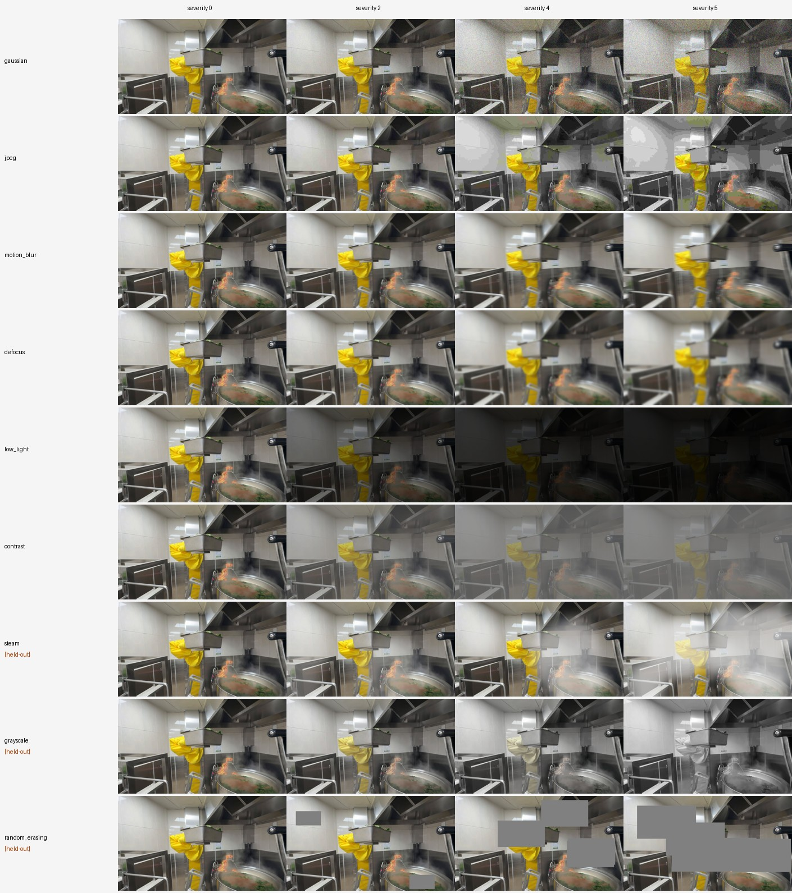
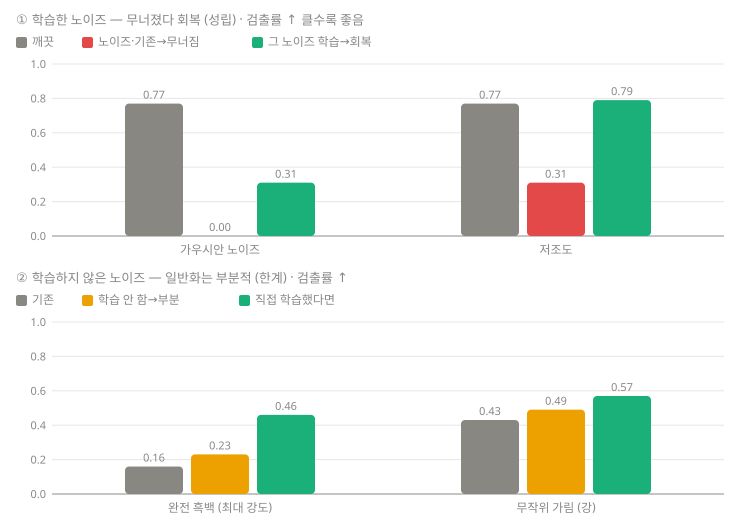
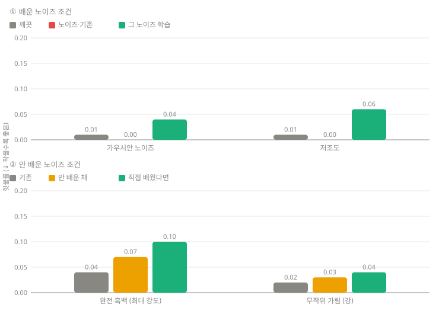
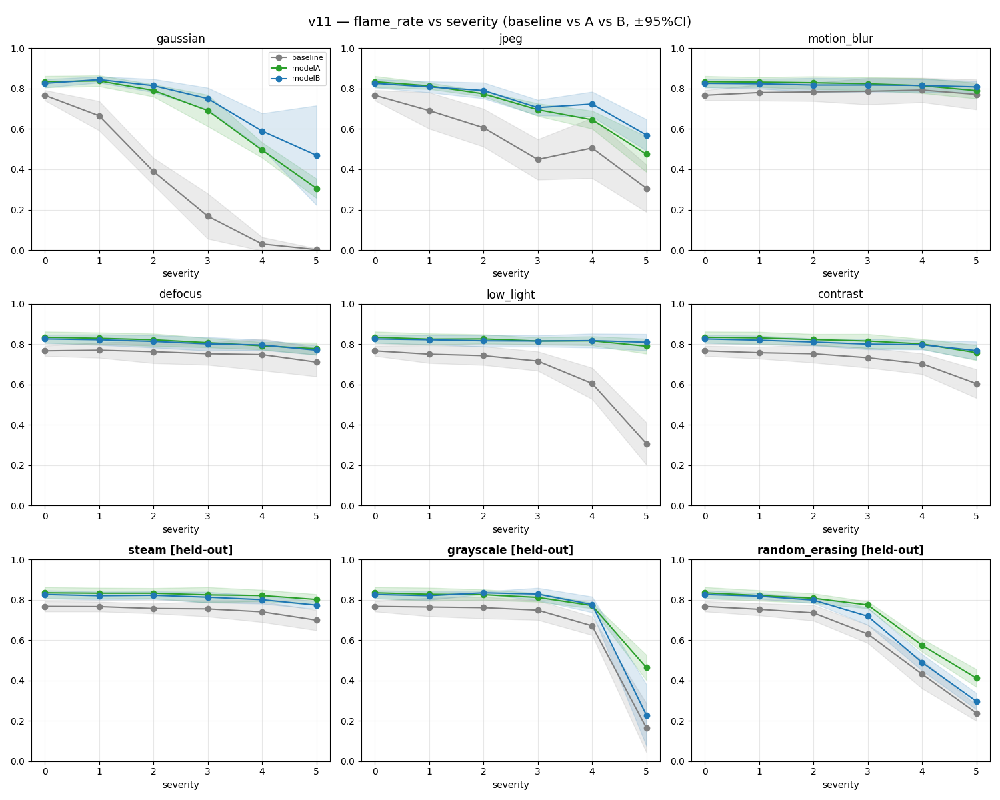
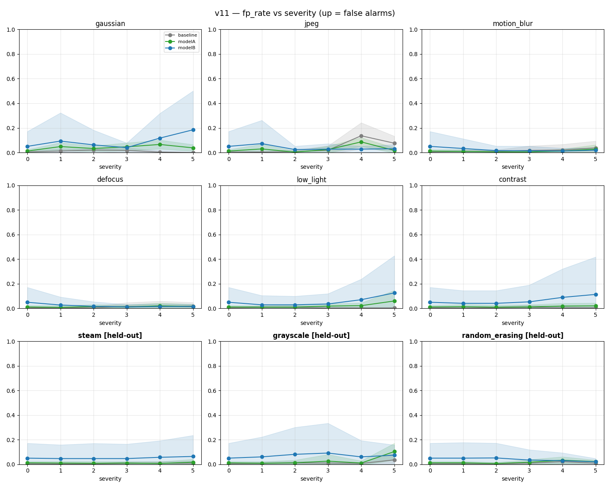
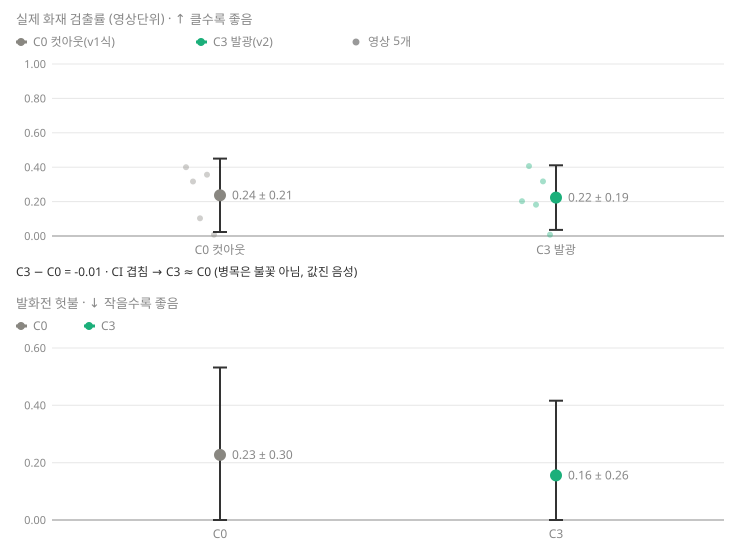

# 조리로봇 화재 인식 — 실데이터·시간축 안전 PoC

## 이 문서의 핵심 용어

- **하드 네거티브** — 화재는 아니지만 불꽃과 시각적으로 비슷해 오탐을 유발하기 쉬운 정상 조리 장면.
- **recall(재현율)** — 실제 화재가 있는 자료 중 화재로 탐지한 비율. **FPR(오탐률)**은 정상 조리를 화재로 잘못 탐지한 비율.
- **frame-level / event-level** — 프레임 한 장씩 평가함 / 여러 프레임의 탐지를 하나의 화재 이벤트로 묶어 평가함.
- **시간축 경보 2-of-3** — 최근 세 프레임 중 두 프레임에서 탐지될 때 경보하는 규칙.
- **채택 / 기각 / 보류 / 미실행** — 현재 운영 후보로 선택함 / 해당 가설을 받아들이지 않음 / 지금은 결론을 내리지 않음 / 아직 수행하지 않음.

> **현재 결론:** 합성 화재 학습만으로는 실제 화재 전이가 약했습니다. 현재 채택 경로는 **실제 화재 데이터 + 급식실 조리 하드네거티브 + 시간축 경보 + 주방별 보정**입니다. 임의의 새 급식실에 하나의 모델을 바로 배포하는 범용화는 아직 해결되지 않았습니다.

## 현재 채택된 결과

| 질문 | 현재 근거 | 판정 |
|---|---|---|
| 실제 화재를 잡는가? | 배포 후보 재현율(recall) `0.813`, 장면 평균 `0.846`; 깨끗한 실화재 13/16 장면은 0.72~1.00 | ✅ 가능성 확인 |
| 정상 조리에 헛불을 내는가? | 조리 음성 자료 미세 조정 학습(fine-tune) 뒤, 안 본 급식실 프레임 단위(frame-level) 오탐률(FPR) `0.459 → 0.066` (`conf 0.25`) | ✅ 크게 감소 |
| 시간축 경보가 도움이 되는가? | 본 급식실에서 2-of-3: 불 이벤트 recall `0.957`, 헛경보 약 `0.206/분` | ✅ 배포 후보 경로 |
| 새 급식실에도 그대로 통하는가? | 안 본 급식실 이벤트-level 헛경보 `1.465/분` — 본 급식실 대비 약 7배 | ❌ 미해결 |
| 급식실의 실제 유류 화재를 직접 검증했는가? | 급식실 조리(음성)와 비급식실 실제 화재(양성)를 분리해 삼각측량함 | ⚠️ 직접 증명 아님 |

**현실적인 운영 결론:** 새 급식실마다 그 주방의 정상 조리 영상을 포함해 보정하는 방식은 근거가 있습니다. 반대로 범용 one-model 배포와 실제 급식실 유류 화재 직접 검증은 향후 과제입니다. 상세 수치·표본·한계는 [STATUS.md](docs/STATUS.md)와 [MEETING_2026-08-26.md](docs/MEETING_2026-08-26.md)를 참고하세요.

## 실험 여정 — 채택과 기각을 분리

| 단계 | 무엇을 검증했나 | 결과 | 현재 상태 |
|---|---|---|---|
| v1 | 합성 불꽃 학습과 노이즈 강건성 | 합성 안에서는 불꽃을 실제로 보지만, 실제 화재 전이는 낮음 (`0.31`) | ❌ 기각 |
| v2 | 실사 화염 아틀라스·발광 합성 | C3가 C0보다 실제 화재 전이를 높이지 못함 | ❌ 기각 |
| v3·표현 실험 | 시뮬레이션, 커리큘럼, 도메인 랜덤화, 엣지·색 전처리, 모델 교체 | RGB 기준을 이기는 일관된 개선 없음 | ❌ 또는 보류 |
| 실데이터 전환 | 실제 화재 학습과 근접중복 누수 통제 | recall 개선; 합성 혼합은 추가 이득 없음 | ✅ 채택 |
| 조리 하드네거·시간축 | 정상 조리 헛불과 지속성 경보 | 헛불 감소, 본 급식실 이벤트-level 경보 개선 | ✅ 채택 |

> 과거 실험의 상세 과정과 음성 결과는 아래 **실험 이력**에 보존했습니다. 이력은 현재 배포 결론의 근거이며, 현재 운영값과 혼동하지 않도록 분리했습니다.

## 다음 단계와 현재 상태

| 항목 | 상태 | 의미 |
|---|---|---|
| 주방별 보정 + 2-of-3 | 현재 채택 | 본 급식실 기준의 현실적 운영 경로 |
| LOSO 전체 교차검증 | 미실행 | 보유한 13개 사이트로 가능한 재분석; 계산 비용이 큼 |
| 박스 단위 평가 | 미실행 | 기존 프레임의 박스 라벨이 필요; 현재 평가는 frame/event-level 프록시 |
| 범용 one-model | 미해결 | 더 다양한 급식실 데이터 또는 시간축 모델이 필요 |
| 생성형 #6 | **코드 준비됨 · 미실행/보류** | 실데이터 경로가 두 축을 해결해 발동 조건이 충족되지 않음; 실행 시에도 실제 화재로만 평가 |

생성형 #6의 프롬프트·큐레이션·학습 설계는 [gen_prompts.md](docs/gen_prompts.md)와 [MEETING §6.4](docs/MEETING_2026-08-26.md)에 보존합니다. 이미지 품질이나 합성 평가만으로 실제 성능을 주장하지 않습니다.

## 읽는 순서

- **최신 팀 보고:** [STATUS.md](docs/STATUS.md)
- **짧은 프로젝트 여정:** [eli5-summary.html](docs/eli5-summary.html)
- **미팅용 요약 / 상세 서사:** [SUMMARY_meeting.md](docs/SUMMARY_meeting.md) · [DETAIL.md](docs/DETAIL.md)
- **사전등록과 원래 합성·노이즈 실험:** [PREREGISTER.md](docs/PREREGISTER.md)
- **실데이터 전환 이후의 재현 절차:** [HANDOFF.md](docs/HANDOFF.md)

---

# 실험 이력 — 합성 화재 인식 + 노이즈 강건성 PoC

---

# 합성 화재 인식 + 노이즈 강건성 PoC

실제 급식실 조리 영상에 **불꽃을 합성**해 화재 이미지를 만들고, 검출 모델이 화재를
인식하는지 — 그리고 그 이미지에 **노이즈를 얹었을 때도** 인식하는지를 판별한다.

> 이전 저장소 [kitchen-fire-poc](https://github.com/K-H-MOON/kitchen-fire-poc) 와
> **같은 원본 영상을 쓰지만 독립 프로젝트**다. 그쪽의 가중치·튜닝값을 재사용하지
> 않고, 원본만 새로 가져와 처음부터 분할한다. (데이터 누수 없음)

## 두 실험

1. **합성 화재 인식** — 주방 배경 + 합성 불꽃(양성) / 배경·하드네거티브(음성)로
   학습 → 미학습 주방에서 화재를 인식하는가.
2. **노이즈 강건성** — 노이즈 강도를 올리며 인식률 저하 곡선을 그리고(Phase A),
   떨어지면 노이즈 증강으로 극복해 곡선을 되올린다(Phase B).

## 실행 환경

- 데이터·영상: **구글 드라이브**
- 처리·학습: **Google Colab** (Drive 마운트)
- 저장소에는 스크립트·분할 매니페스트·문서만. 영상·프레임·가중치는 올리지 않음.

## 파이프라인

| 단계 | 스크립트 | 상태 |
|------|------|:---:|
| 0. 영상 인벤토리 | `scripts/videos.json` (28영상·13사이트) | ✅ |
| 1. 사이트 분할 (사전 등록) | `scripts/assign_split.py` → `split.json` | ✅ |
| 2. 배경 프레임 추출 | `scripts/colab_extract_frames.py` | ✅ (2,881장) |
| 3a. 불꽃 소재 인벤토리 | `scripts/flames.json` | ✅ |
| 3b. 불꽃 풀 배정 | `scripts/assign_flame_split.py` → `flame_split.json` | ✅ |
| 3c. 불꽃 매트 추출 | `scripts/colab_extract_flames.py` | ✅ (konro 오염 제외) |
| 4. 불꽃 합성 + 자동 박스 | `scripts/colab_synth.py` | ✅ (2,278/294/309) |
| 5. 학습 (YOLO) | `scripts/colab_train.py` · `colab_phaseB_train.py` | ✅ 30회(v8·v11 ×3config×5seed) |
| 5.6 불꽃 제거 검증 — 불꽃을 지우면 검출도 사라지나 (배경이 아닌 **불 자체**를 보는지·핵심) | `scripts/colab_ablation.py` | ✅ 통과(불꽃 0.81 ≫ 배경 0.005) |
| 6. 노이즈 저하 곡선 (Phase A) | `scripts/colab_noise_curve.py` | ✅ (6b eval 에 통합) |
| 6b. 노이즈 증강 극복 (Phase B) | `scripts/colab_phaseB_train.py` · `colab_phaseB_eval.py` | ✅ eval 완료 |
| 7. 실제 화재 검증 — 합성이 실전 불에 전이되나 (정직성) | `scripts/colab_realfire_test.py` | ✅ 0.31(하한·전이 약함) |

> **노이즈 9종** (`noise_lib.py`, 강도 0→5): 화질계 6 — gaussian(가우시안)·jpeg(압축)·motion_blur(모션블러)·defocus(초점흐림)·low_light(저조도)·contrast(대비); 그 외 3 — steam(수증기)·grayscale(흑백)·random_erasing(무작위 가림).
>
> **6번**은 9종 전부에 저하 곡선을 그리고, **6b**는 modelA(9종 전부 증강)·modelB(화질 6종만 증강 + steam·grayscale·random_erasing을 held-out으로 일반화 검증)로 나눔.

*가로축 **severity = 노이즈 강도**(0 = 원본, 5 = 최대). 합성 화재 이미지 한 장에 노이즈 9종을 강도 0·2·4·5로 적용한 예시. 아래 3종(steam·grayscale·random_erasing)은 modelB 학습에서 뺀(held-out) 일반화 시험용.*

> **Level 2 (아키텍처 감도)**: 위 5·5.6·6·6b·7을 YOLO8s로 한 바퀴 → 동일 프로토콜을 YOLO11s로 미러링(각 15회) → 결론이 아키텍처에 견고한지 CI로 교차검증. (LONO는 결과 보고 조건부.)

확정한 설계·근거는 **[docs/PREREGISTER.md](docs/PREREGISTER.md)** 에 있음.

## 결과 요약 (2026-08-20)

30회 학습(v8·v11 × baseline/modelA/modelB × 5 seed) + eval + 실제화재 + ablation 완료.
노이즈별·강도별 수치·95%CI·per-video 등 상세는 **[docs/TIMELINE.md](docs/TIMELINE.md)** 의 `결과` 절.

> **용어**
> - *지름길*: 불꽃을 안 보고 배경·유니폼 같은 엉뚱한 단서로 맞히는 것
> - *강건성*: 노이즈가 껴도 검출이 유지되는 성질
> - *전이*: 합성으로 배운 게 실제 영상에도 통함
> - *병목*: 성능을 가장 크게 붙잡는 핵심 제약
> - *헛불(오탐)*: 불이 없는데 불이라고 함(놓침의 반대 오류)
> - *held-out*: 일부러 학습에서 뺀
> - *OOD*: 학습에서 안 본 종류의 장면

**성과**

1. 합성 파이프라인이 **배경 지름길이 아닌 진짜 불꽃 검출기**를 만듦 — 불꽃을 지우면 검출이 0.808→**0.005**로 사라지고 음성 오탐 0/116(ablation). 앞 저장소의 유니폼 지름길 실패(49.7%)를 넘어섬.
2. **노이즈 강건성 성립**: 노이즈가 검출을 무너뜨리고(gaussian 0.77→0.00 등), 그 노이즈를 학습하면 회복되며(modelA low_light 0.31→0.79), 이 결론이 **두 아키텍처(v8·v11)에서 똑같이** 나옴(±95%CI). — 단 합성 데이터 안에서의 이야기.

**한계**

1. **합성으로 배운 게 실제 불에는 약하게만 통함(전이 0.31, 하한)**. ablation이 "배경 탓"을 기각하므로, 병목은 **학습에 쓴 합성 불꽃의 종류가 적고 실제와 덜 닮은 것**(소재 4종 과적합) — hisomu(거대 화염) 0.04가 방증.
2. **노이즈 강건성을 키워도 실제 전이는 안 좋아짐**(modelA 0.32 ≈ baseline, 헛불은 0.09→0.16 악화). 강건성 이득은 **학습에 쓴 분포 안에서만** 유효.
3. **학습하지 않은(held-out) 노이즈로의 일반화는 같은 종류에 한해 부분적**(구조적 가림엔 안 됨).
4. **새 오류 유형**: 학습에서 안 본 실제 장면(OOD)의 **사람을 불꽃으로 오인(헛불)** — 합성 test엔 없던 것.

**노이즈 강건성 (검출률과 헛불을 같이 읽어야 함)**

*그림 1. 노이즈 강건성 — 검출률(↑ 클수록 좋음). 노이즈에 무너졌다가, 그 노이즈를 학습하면 회복.*

노이즈가 기존 모델의 검출을 무너뜨리고(가우시안 0.77→0.00), 그 노이즈를 학습하면 회복된다(저조도 0.31→0.79). 회복 폭은 노이즈마다 다르고, **학습하지 않은 노이즈(완전흑백·무작위 가림)엔 일반화가 부분적**이다.

*그림 2. 같은 조건의 헛불률(↓ 작을수록 좋음). 검출을 되살린 모델이 헛불도 올림 → 검출률과 반드시 같이 읽는다.*

**검출률만 보면 "불을 잘 잡는 모델"과 "아무거나 불이라 우기는 모델"이 똑같이 높게 나온다.** 그래서 헛불을 짝으로 본다 — 검출을 되살린 모델(초록)이 **헛불도 함께 올렸다**(완전흑백 0.04→0.10). 강건성 이득엔 "더 관대해짐"이라는 대가가 따르므로, `성립` 판정은 **검출률↑과 헛불 유지를 동시에** 만족할 때만 내린다.

> ①의 "노이즈·기존 모델" 헛불 `0.00`은 좋은 게 아니다 — 화면이 뭉개져 아무것도 검출 못 해 참불·헛불이 다 0인 것뿐(그 조건 검출률도 0). 헛불은 검출률과 반드시 같이 읽는다.

전체 9종 × 강도 0~5 곡선 (±95%CI, v8·v11)

출처 `fire_frames/phaseB_eval/phaseB_agg.json` · 생성 `colab_phaseB_eval.py`. 위 두 PNG는 Colab에서 `phaseB_eval/v11_flame.png`·`v11_fp.png`를 `docs/img/`로 복사·커밋하면 표시됨(아래 스니펫).

**병목 진단을 좁히는 관찰 (가설)**: synth 데이터를 육안 검수하니 **합성 불꽃이 대체로 납작한 주황 "컷아웃"**처럼 보임 — 실제 불의 발광·입체감·주변 조명 스필이 없음(알파 오버 합성이라 가산 블렌딩·글로우·엣지 페더·색보정·코어 블룸이 빠짐). 모델이 이 컷아웃 형태를 학습해 실제 불에 약하게만 전이됐을 유력 후보. **실험 미검증 가설이나 데이터셋 육안 검수로 corroborate됨.** → 개선 우선순위: 신규 소재 수집(다양성)보다 **합성 현실성 개선**이 값싸고 유력.

*왼쪽: 우리 v1 합성 불꽃(납작한 컷아웃) / 가운데: 실제 유류 화재(발광·입체감) / 오른쪽: 실사 화염 아틀라스(v2에서 쓸 후보 소재, kitchen-fire-poc). 왼쪽 컷아웃과 가운데 실제 불의 차이가 전이 약함의 유력 원인 — 아래 v2는 오른쪽 같은 발광 소재로 공략.*

**외적 타당성의 경계**: synth test는 급식실 배경 × 합성 불꽃, realfire는 실제 불 × 비급식실 장면 — **급식실 실화재(둘의 교집합)는 어느 시험도 직접 덮지 못함**(실화재 자료 부재). 두 축을 겹쳐 미루어 보는 것이지 직접 증명이 아니며, 실제화재 0.31은 경계 슬롭·연기 가림을 포함한 **하한**임.

**요약**: 합성으로 만든 화재 데이터에서는 노이즈를 씌워도 불을 잡고(강건성), 배경이 아니라 불 자체를 보고 판단(지름길 아님)하는 검출기를 만들 수 있었다. 그러나 학습에 쓴 **불꽃 종류가 너무 적어 실제 화재 영상에는 약하게만 통했고**, 노이즈 학습을 더해도 그 격차는 좁혀지지 않았다.

## v2 상세 (실사 아틀라스 · 병행)

> 로드맵(v1·v2·v3)은 맨 위 **방향 전환 제안** 참조. 여기는 **v2 실행 설계**다.

v1의 병목(합성 불꽃의 **플랫·협소**)을, 이전 저장소 [kitchen-fire-poc](https://github.com/K-H-MOON/kitchen-fire-poc)의
**실사 화염 아틀라스**(repo `assets/flamelib`에서 회수 — 이미 확보) + **발광 합성**(가산 블렌딩·엣지 페더·조명 스필)으로 공략한다.
불꽃 소스 × 합성 방식을 한 단계씩 바꾼 조건(C0=v1 → C3=풀 v2)으로 **무엇이 효과였는지 분리**하고,
검증은 **"학습에 안 쓴 불꽃 + 안 쓴 배경"**으로만 재서 "같은 텍스처 다른 배경" 착시를 차단한다.
단, 이전 저장소가 같은 도구로도 sim2real을 못 닫았으므로 **개선은 유력하나 해결은 보장하지 않는다.**
v1 하네스를 재사용하므로 **v1보다 짧게**(핵심 A/B ~3~5일) 완결 가능 — **v3 시뮬레이터 구축과 병행**한다.

→ 상세 설계·조건 C0~C3·성공 기준·단계별 계획: **[docs/PREREGISTER_v2.md](docs/PREREGISTER_v2.md)**

## v2 결과 (2026-08-21 · Phase 1 완료 — 음성)

**판정: 가설 기각.** 불꽃을 실사 아틀라스(390장·8소스)로 바꾸고 발광·조명 스필까지 넣어도(C3),
실제 화재 전이가 v1(C0)보다 오르지 않았다. **병목은 불꽃의 현실성·다양성이 아니었다.**

realfire 영상 단위(5영상 · 각 5 seed · ±군집 CI):

| 지표 | C0 (=v1) | C3 (=풀 v2) | delta |
|---|---|---|:---:|
| flame_rate (주지표·↑) | **0.237 ± 0.213** | **0.223 ± 0.188** | **−0.014** |
| fp_rate (헛불·↓) | 0.227 ± 0.305 | 0.156 ± 0.260 | −0.071 |

영상별(C0/C3) jikken 0.40/0.20 · tokyo 0.32/0.41 · kanetsu 0.10/0.18 · grease 0.36/0.32 · hisomu 0.01/0.01
— **일관된 방향 없음(2↑ 2↓ 1 tie)**, delta의 CI 완전 겹침.

*그림. realfire 영상 단위 검출률 C0 vs C3(±군집 CI). 불꽃을 발광·다양하게 바꿔도 전이가 안 올랐다.*

**음성이 진짜임을 확정한 가드 (ablation, v8_C3_s1, 합성 test):** 불꽃을 지우면 검출이
flame **0.942 → bg 0.000**(음성 오탐 0/136)으로 사라진다 → C3 모델은 **불꽃을 실제로 쓴다**(지름길 아님).
즉 realfire 음성은 "C3가 망가져서"가 아니라 **모델이 불꽃을 제대로 학습했는데도 실제 화재로 전이가 안 된 것**이다.
병목은 불꽃 바깥(배경·씬 도메인갭·temporal·표현/백본)으로 좁혀진다 — 이전 저장소
[kitchen-fire-poc](https://github.com/K-H-MOON/kitchen-fire-poc)가 같은 아틀라스·셰이더로도 sim2real을 못 닫은 것과 정합.

**경계(정직):** realfire 영상이 5개뿐이라 CI가 크다. **"큰 효과 없음"은 확실하나 작은 효과는 배제 못 한다**
— 확정하려면 realfire 확장(유류화재 추가·학습 0·n↑)이 필요. hisomu(거대 불꽃)는 C0·C3 둘 다 ~0으로,
이 A/B가 다루지 않는 **별개의 실패 모드**다. 상세 수치·판정 근거: **[docs/PREREGISTER_v2.md §10](docs/PREREGISTER_v2.md)**.

## 실데이터 방향 결과 (미팅 후 · 2026-08-25)

> v1~v3이 "불꽃 현실성도 표현/백본도 전이 레버가 아니다"로 수렴 → **병목 = 데이터/도메인**으로 확정.
> 미팅 후 방향을 **실제 화재 데이터로 공략**으로 틀었다. 상세 서사 → **[docs/AFTER_meeting.md](docs/AFTER_meeting.md)** · 재현·스크립트 → **[docs/HANDOFF.md](docs/HANDOFF.md)**.

**성과 — 실데이터가 두 축(놓침·헛불)을 다 풀었다**

1. **놓침(recall)은 실데이터로 해소.** 합성-only 검출 0.235 → 실데이터 학습 **0.985**(같은 실내화재 test·frame-level). 근접중복 그룹 재분할로 누수를 걷어내도 **0.899**로 견고. 유류·주방 화재로의 도메인 이동도 전이(큰불 pilot 0.985·초기 작은불 0.97~1.0 vs 합성 0.52·0.27).
2. **채택 실화재로 배포후보 재측정(④).** 수집한 유류/주방 실화재 16장면을 frame-level test로 만들어 재측정. 양성 구간 육안 검증에서 **교육/실험 영상의 비화염 오염**(발화 전 예열·안전수칙 텍스트카드·잔해)을 발견·교정한 뒤: 배포후보(`real_only_grouped`) **recall 0.813 · 장면평균 0.846**(합성 0.357), 깨끗한 실화재 **13/16 장면이 0.72~1.00**. → **recall 은 추가 학습 없이 이미 쓸 만**(유일 약점 = NIST식 창백·저대비 극소형불).
3. **헛불(fpr)은 급식실 조리 네거티브로 공략(⑤).** 배포후보의 유일 병목은 **정상 조리에 헛불**(급식실 조리 CCTV fpr 0.26). 예측박스 진단 결과 헛불은 전부 **비화염**(불색 조리음식·스팀·스테인리스 반사)이라, 급식실 조리 영상을 하드네거티브로 재학습(`real_only_grouped_ck`). recall 비용은 작음(장면평균 0.846→0.815, 손실이 가장 약한 흐린불에 집중). **★ 일반화는 "사이트(학교) 단위" 로 정직하게 재검증**: 28 조리영상은 **13개 학교 급식실**에서 왔는데(파일명이 사이트 명시), 첫 held-out 은 영상 단위라 8개 중 7개가 **학습에 본 사이트의 다른 영상**이었다(= 동일주방 내 일반화, fpr 0.302→0.032 는 낙관적). **4개 사이트를 통째로 held-out(leave-site-out) 해 재학습·재측정**(`real_only_grouped_cksite`): **안 본 4개 급식실에서 fpr 2g 0.459 → 0.066(conf 0.25) / 0.033(conf 0.35), 약 7× 감소** — recall 유지(장면평균 0.814). → **⑤ 는 안 본 급식실로도 일반화한다(진짜 교차-주방)**, 다만 정직한 값은 within-site 0.032 가 아니라 **cross-site 0.066(conf 0.25)·0.033(conf 0.35).** ⚠️ **단 이 fpr 은 성긴 프레임 표집 값** — 전체 조리 세션을 조밀 관측하는 이벤트-level(성과 4)에선 안 본 급식실 헛경보가 훨씬 높다(지속되는 불색음식이 남음). 배포 관점 결론은 성과 4 참조.
4. **시간축 지속성이 프레임 트레이드오프를 이벤트-level에서 해소(B) — 단 "본 급식실"에 한해.** 밀집 프레임(0.5s)에 **K-of-N 지속성 경보**를 얹어 **길이-독립 지표(헛경보/분)** 로 측정. **2-of-3 이 스위트스폿** — 불 이벤트 recall **0.957** 유지, 진짜 불은 지속돼 안 깎이고 조리 헛불은 대부분 순간 깜빡이라 걸러진다. **★그러나 "본 급식실 vs 안 본 급식실"이 갈린다**(같은 모델 `_cksite`·같은 지표로 깨끗이 격리): **본 급식실 헛경보 0.206/분**(≈5분당 1회·recall 0.957), 4-of-7 에선 **0.000/분**(recall 0.826) — **안 본 급식실은 1.465/분**(≈40초당 1회, ~7배 악화). → **배포 운영점(per-site 보정) = `_cksite`류 · conf 0.25 · 2-of-3**(본 급식실 헛경보 ~0.2/분·recall 0.957). **범용 one-model(안 본 급식실)은 미해결**(1.465/분).

**한계·경계 (정직)**

1. **외형 모호성 = 근본 트레이드오프.** 배경-격리 스트레스 테스트(A: 같은 실불꽃을 급식실 vs 대조 주방 배경에 합성·검출률 비교)로 확인 — **급식실 배경 자체는 실불꽃 검출을 하드-차단하지 않음**(대조 대비 소폭↓, real_only 0.88·2g 0.83, held-out 급식실). 다만 **⑤의 억제가 급식실 실불꽃 민감도까지 함께 낮춤**(2ck 0.69). 놓침은 **불꽃이 불색 음식·밝은 반사와 겹치는 곳**에 집중 → 색·외형만으로는 진짜 불과 불색 음식을 못 가른다. 외형 기반 노브(⑤ 강도·conf 문턱)는 이 곡선 위를 미끄러질 뿐 → **곡선을 벗어나는 축은 시간축(모션)**(진짜 불은 깜빡·성장, 음식은 아님). **B(시간축 2-of-3)가 이를 확인**(위 성과 4): 이벤트-level 에서 불 recall 0.957 유지·조리 헛경보 0.125 로 회복. 다만 **시간축도 못 죽이는 잔여**가 남는다 — ① 조리 헛불 1/8 은 "순간 깜빡"이 아닌 **지속되는 불색 음식**(2-of-3 이상 올려도 불변) · ② 가장 흐린 창백불 이벤트 1/23 은 프레임 검출이 ~0 이라 지속성으로도 못 살림. 둘 다 외형 모호성의 환원 불가 잔여.
   - *경계(정직):* 시간축 회복은 **실화재 test 이벤트(대부분 비-급식실)에서 직접 입증** — 급식실 화재 자체는 데이터가 없어 같은 원리로 **추론**할 뿐 직접 측정 못 함(2번 삼각측량 한계 그대로).
   - *재검토 주석(정직):* A 초회는 CAFE 배경에 2ck 학습 장면이 섞여 2ck 수치가 살짝 비관적이었음(0.667). held-out 급식실로 재측정해 **0.692** 확인 — **편향은 실재했으나 작았고**(억제가 학습 장면 암기가 아니라 급식실 외형 타입 전반에 일반화), 결론 불변.
2. **실 급식실 화재 부재 — 삼각측량이지 직접 증명 아님.** 급식실 조리(음성) + 딴 데 유류불(양성)의 교집합인 **급식실 실화재는 어느 시험도 직접 덮지 못함**. 실화재 데이터는 확보도 통제 실연도 불가(능력 밖) → 갭은 A(배경격리)·B(시간축)로 **좁히기만 하고 닫지 못한다.**
3. **합성은 이 갭을 못 닫는다** — 검증에 쓰면 순환(v2가 "실불꽃 합성도 전이 무기여" 실증). 학습 보강용으로만 쓸 수 있으나 기대값 낮음.
4. **범용(안 본 급식실) 배포는 미해결 — per-site 보정이 현실 경로.** 28 조리영상=13개 학교 급식실. 사이트(학교) 단위 leave-out + 전체영상 이벤트-level 로 검증하니(같은 모델·같은 지표로 격리): **본 급식실 헛경보 0.206/분 vs 안 본 급식실 1.465/분(~7배).** 즉 **한 모델로 임의의 새 급식실에 바로 배포하면 헛경보가 잦다**(지속되는 불색음식이 시간축도 통과). → **배포는 "새 급식실 설치 시 그 주방 조리 영상을 학습에 포함"(per-site 보정)이 현실 경로** — 그러면 본 급식실 수준(≈0.2/분·recall 0.957)으로 낮아진다. 범용화는 사이트 다양성↑·시간축 모델 등 향후 과제.
5. **frame-level 프록시**("불 있나/없나"지 위치·실시간 아님) · **held-out N 작음**(N 9영상 17분 등·CI 큼) · 이벤트-FA는 표집·사이트 편중에 민감(길이-독립 "헛경보/분"으로 완화하나 N 한계 잔존).

## 분할 (사이트 단위)

| 세트 | 사이트 | CCTV |
|------|------|:---:|
| train | 금정초·남일고·논현중·부산체고·숭곡중·영동중·울산현대차·원촌중·진선여고 | 0 |
| val | 로봇고·인화여중 | 0 |
| test | 개원중·내곡중 | 2 (배포에 가장 가까움) |

같은 주방은 한 세트에만 사용 — 배경·조명을 외워서 생기는 누수를 막음.

## 학습 신뢰성 (과적합·누수 통제)

학습이 "정직한가"(외워서 부풀린 성적이 아닌가)를 두 축으로 통제·확인한다. 상세 `docs/HANDOFF.md §F`·`docs/PREREGISTER_v2.md §5.7`.

- **에폭 과적합 없음** — 프로브로 `EPOCHS=60` 상한 확정(정점 ~55 담고 그 위 군더더기 버림). 실데이터 재학습(2026-08-24)에서 사후 실증: val mAP 가 하락 없이 **평탄**, `real_only_grouped_hn` 은 **ep59 조기종료 → best=ep44 체크포인트 선택**(60 을 다 쓰지 않음), 평가·배포엔 마지막이 아니라 **`best.pt`(val-best)** 사용.
- **누수 통제** — ① 이미지 분할은 **사이트 단위**(위 표: 같은 주방은 한 세트에만). ② 실데이터 학습에선 **근접중복(perceptual hash) 그룹 재분할**로 거의 동일한 인접 프레임이 train·test 에 걸치지 않게 함(랜덤분할 누수로 부푼 수치를 걷어냄).

> 경계: 이 "과적합 없음"은 **학습 도메인 기준**이다. 목표 도메인(유류·주황조명) 일반화 실패는 과적합이 아니라 **도메인 갭**(데이터로 고치는 별개 문제).
