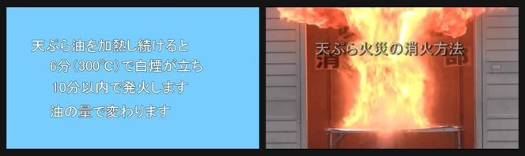
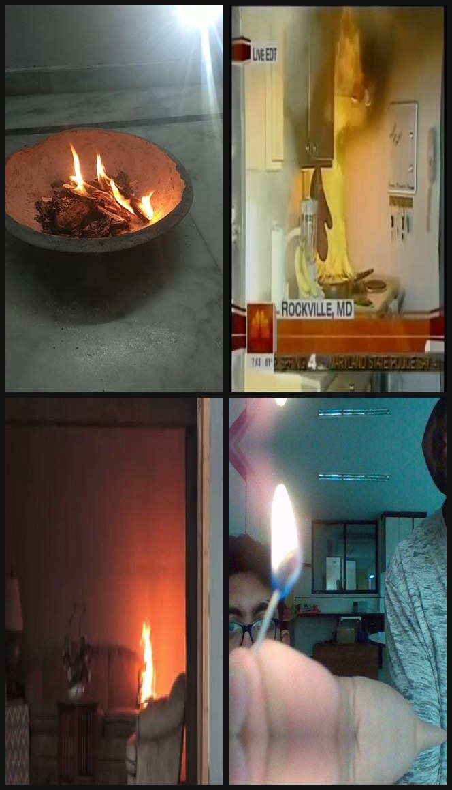

# 미팅 이후 과정 요약 (2026-08-24~, 진행 중)

> [미팅용 요약(SUMMARY_meeting.md)](SUMMARY_meeting.md)이 v1~v3까지라면, 이 문서는 **회의 후 새 방향의 진행 기록**이다. 결론: v1~v3로 **병목 = 데이터/도메인(합성↔실제 간극)**으로 좁혀졌고, 회의 후 **실제 화재 데이터**로 공략 → **실험 A에서 실데이터 학습이 놓침을 없앰을 직접 확인**(같은 Indoor test에서 recall **0.235 → 0.985**, §5). 단 **같은 도메인·프레임분할 누수라 절대값은 낙관적** — 견고한 건 "실데이터가 놓침 병목을 고친다"는 방향이며 급식실 배포 성능은 별개.

## 회의에서 정해진 방향
- v1(불꽃 현실성)·v2·v3(표현/DINOv3) 모두 실제 전이 못 올림 → **병목은 모델이 아니라 데이터/도메인.**
- → **실제 화재 데이터**를 확보해 학습/평가에 투입(합성만으로는 진짜 불을 못 배움).

## 단계별 진행

**1. "무엇을 놓치나" 진단 (error-analysis) — 그리고 평가셋 오염 발견**
기존 모델을 실제 화재에 돌려 놓침 패턴을 분석하려 했다. → 그 과정에서 **평가셋 자체가 오염돼 있음을 발견.**

- **realfire 5편 중 최소 3편(jikken·kanetsu·hisomu)이 편집된 소방 홍보(PSA) 영상**이다 — PIP·자막·만화 불·타이틀 카드. "fire" 라벨이 붙은 프레임에 **실제 불이 없거나 그래픽에 가려짐** → 모델이 정당하게 안 잡은 것을 "놓침"으로 오집계.
- **"밝은 장면을 못 잡는다"는 완전한 착오였다.** 그 "밝음"의 정체는 불이 아니라 **파란 타이틀 카드·분홍 만화 배경·흰 자막의 밝기**였다. → **육안으로 안 봤다면 "밝은 장면 화재"라는 엉뚱한 방향으로 데이터를 모을 뻔했다** (error-analysis를 먼저 한 것이 이걸 잡아냄).

> **그림.** kanetsu 편(소방 PSA)의 "놓침"으로 집계된 프레임 예시. **왼쪽**: "fire" 라벨이지만 실제 불은 없는 **파란 타이틀 카드**(밝기만 높음) — "밝은 장면 못 잡음"의 정체. **오른쪽**: 실제 큰 튀김유 화염이지만 "天ぷら火災の消火方法"·"吹田市消防本部" **자막·브랜딩이 덮인 편집 화면** — 둘 다 모델 무검출(conf 0.00)로, 오염된 평가에서 놓침으로 오집계됨. (출처: 吹田市消防本部 화재 예방 PSA 캡처 · error-analysis 육안 판독용 저해상 인용.)
- 곁발견: **grease 편은 nofire 오라벨**(실제 불 포함) + 야외 화재 → 정확 검출이 FP로 오집계.
- **함의: 기존 realfire recall(0.31·0.27 등)은 심하게 오염·과소평가된 값이다. 모델이 실제 화재에서 얼마나 하는지 우리는 아직 제대로 모른다.** (상대 비교는 같은 셋 공유라 비교적 견고, 절대값만 신뢰 불가.)

→ **바로 이것이 이후 모든 작업의 이유다:** 오염된 자로는 성능을 알 수 없으므로, **깨끗한 실제 데이터를 확보해(2) 오염 없는 자로 다시 재고(3), 놓침의 진짜 원인을 진단하고(4), 실데이터 투입으로 고쳐본다(5, 실험 A).**

**2. 실제 데이터 확보·검증**
- **Indoor Fire Smoke** (5000장·YOLO·fire/smoke, 실촬영 실내 화재) — 주 대상.
- New_sample (750장·AI-Hub·야외) — 후순위.
- **육안 감사 통과**: Indoor은 실촬영이고 라벨 신뢰할 만함(nofire=연기·미스트 등 하드네거, fire=박스가 실제 불꽃). 단 **주방/유류 아닌 일반 실내 화재**(도메인 부분 일치).

**분할·분량 (실험 A 학습/평가용)** — 우리가 임의로 나눈 게 아니라 **데이터셋(Roboflow export) 제공 분할을 그대로 사용**(랜덤 프레임 단위 70/15/15). **fire-only 재구성**으로 smoke 라벨을 제거하고 fire만 남겨(빈 라벨 = 음성) 합성 모델과 **1클래스로 공정 비교**:

| 분할 | 비율 | 장수 | 구성 | 용도 |
|---|---:|---:|---|---|
| train | 70% | 3,500 | fire + nofire | yolov8s 파인튜닝(학습) |
| valid | 15% | 750 | fire + nofire | 모델선택·조기종료 기준 |
| test | 15% | 750 | **fire 392 · nofire 358** | 최종 frame-level 지표(학습·튜닝 **불가침**) |
| **합계** | 100% | **5,000** | — | — |

> **요지 — 비율은 문제 아님:** 70/15/15는 표준이고 절대 장수(train 3,500 · test fire 392 → recall 95% CI ±4.5%)도 충분해 바꿀 이유가 없다. **성능을 좌우하는 건 비율이 아니라 분할 '단위'**(프레임 랜덤분할 → 약한 누수)이며, 같은 test로 3조건을 상대 비교하므로 그 영향조차 결론을 흔들지 않는다.

- **비율은 적절**: 5000장에 70/15/15는 표준적. 특히 **val을 "실제" Indoor valid로** 둬서 회의 때 지적된 "합성 val 손해"(모델을 합성 기준으로 고르는 문제)도 해소.
- **정직한 한계**: 랜덤 **프레임** 분할이라 같은 영상의 인접 프레임이 train과 test에 갈릴 수 있음 → **약한 누수로 test 성능이 다소 낙관적**일 수 있음. 이상적 분할은 씬/영상 단위지만, 데이터셋이 프레임 단위로 제공돼 우리가 통제 못 함(§정직한 경계에도 기재).

**3. 깨끗한 첫 측정 (오염 없는 자로)**
기존 합성 모델을 Indoor Fire Smoke에 측정 → **recall 0.201 · precision 0.846 · fpr 0.040.**
- **낮은 recall은 진짜** (PSA 오염 탓 아님). **precision 높고 헛불 적음 → 문제는 놓침(recall).** 확정.

**4. 놓침 원인 진단**
놓친 이미지 육안(`_miss.jpg`): **크고 화면을 채우는 불·다양한 장면을 놓침.** → 우리 합성이 **작은 불꽃 스프라이트(화면 15~45%)만** 얹어서 모델이 "작은 국소 불꽃"에 과적합 → **크고 다양한 실제 불을 못 알아봄.** (작은 뚜렷한 불은 잘 잡아 precision 높음.) **고칠 수 있는 병목.**

> **그림.** 깨끗한 Indoor Fire Smoke 셋(오염 없음)에서 **놓친(conf 0.00) 프레임 예시.** 화로 불·TV뉴스 주방 스토브 화재(ROCKVILLE MD)·거실 화염, 그리고 대비로 아주 작은 성냥불까지 — **크고 화면을 채우거나 장면이 다양한 불을 놓치고, 반대로 극단적으로 작은 불도 놓친다.** 작은 국소 불꽃 스프라이트만 학습한 결과와 정확히 맞는 실패 패턴.

**5. 실험 A — 합성 vs 실 vs 혼합 (완료)**
"**실제 화재를 학습에 넣으면 놓침이 줄어드나?**" 직접 검증.
- 데이터: Indoor Fire Smoke fire-only(1클래스), 70/15/15 = train 3500 / valid 750 / **test 750(fire 392·nofire 358)**.
- 3조건 · **같은 실제 test**: ① 합성-only(기존 v8_C0_s1) · ② 실-only(Indoor train) · ③ 혼합(합성 synth_C0 + Indoor train). val=실제(Indoor valid) · 각 60 epochs.
- 지표: frame-level recall/precision/fpr.

## 결과
| 조건 | recall | precision | fpr | 검출(fire) |
|---|---:|---:|---:|---:|
| 1. 합성-only | 0.235 | 0.868 | 0.039 | 92 / 392 |
| 2. 실-only | **0.985** | **0.990** | 0.011 | **386 / 392** |
| 3. 혼합 | **0.985** | 0.980 | 0.022 | 386 / 392 |

**판정:**
- **① → ②: recall 0.235 → 0.985 (놓침 300/392 → 6/392).** 실제 화재를 학습에 넣자 놓침이 사실상 사라짐 → **"놓침(recall) 병목은 실데이터로 고쳐진다"가 직접 확인됨.** 이 실험의 핵심 성과. precision·fpr도 동시에 개선(0.99·0.011).
- **③ vs ②: recall 동일(0.985), 혼합이 precision 0.990→0.980·fpr 0.011→0.022로 오히려 미세하게 나쁨** → **합성은 실데이터 위에 얹어도 기여 없음(살짝 해로움).** v1~v3의 "합성 전이 안 됨" 음성 결과와 정합.

> **⚠️ 절대값 오독 금지 (중요):** 0.985는 **같은 도메인(Indoor) test** 성적이며, **급식실/유류 화재 배포 성능이 아니다.** 게다가 **프레임 단위 랜덤분할 누수**(§2 한계)로 절대값이 부풀었을 가능성이 크다(0.985는 비현실적으로 높음). **견고한 결론은 "방향"뿐** — ② ≫ ①(실데이터가 놓침을 없앤다)와 ③≈②(합성은 무기여). 절대 수치는 낙관적으로 봐야 하며, 다음 단계에서 **도메인 이동(급식실 근접) 평가**와 **씬/영상 단위 분할 재측정**으로 검증해야 한다.

> **왜 0.235 → 0.985로 이렇게 크게 올랐나 (오독 방지):** 상승폭의 **주 원인은 "실데이터가 마법"이라서가 아니라 평가 조건이 바뀐 것**이다. ① **이제 전이가 아니라 같은 분포(in-distribution) 평가** — 학습·test 둘 다 Indoor Fire Smoke(같은 도메인)라 원래 높게 나옴(가장 큰 요인). ② **출발점이 비정상적으로 낮았음** — 합성 모델이 작은 스프라이트에 과적합해 바닥이 0.235. ③ **frame-level recall은 관대한 지표**(이미지당 박스 1개만 잡혀도 성공; 참고로 학습 중 박스단위 val recall은 ~0.83). ④ **프레임 랜덤분할 누수**로 상단이 더 부풀었을 가능성. → **진짜로 남는 건 "놓침 = 도메인갭이고 분포를 맞추면 해소된다"는 방향**이지, 0.985라는 크기 자체가 배포 성능인 것은 아니다.

## 정직한 경계
- **실험 A의 0.985는 절대 성능이 아니다.** ① 같은 도메인(Indoor) test라 급식실/유류 화재 배포와 별개 · ② 프레임 랜덤분할 누수로 부풀었을 가능성 큼. → **"실데이터가 놓침을 없앤다"는 방향은 견고, 절대값은 낙관적.**
- Indoor Fire Smoke는 **일반 실내 화재(주방/유류 아님)** → "실데이터가 실화재 recall 올리나"는 답하나 **급식실 성능은 여전히 별개**(급식실 실화재 자료 부재).
- Roboflow 랜덤분할 → 인접 프레임 약한 누수 가능(§2·§5 재측정 필요).
- 기존 realfire(PSA)는 오염 → 절대 수치 신뢰 불가(상대 비교는 견고).

## 관련 문서·스크립트
- 수집 사양·놓침 진단: [DATA_collection_spec.md](DATA_collection_spec.md)
- 진행 로그·실험 A 설계: [HANDOFF.md](HANDOFF.md)
- 스크립트: `colab_realfire_erroranalysis.py` · `colab_indoorfire_eval.py` · `colab_indoorfire_train.py`
