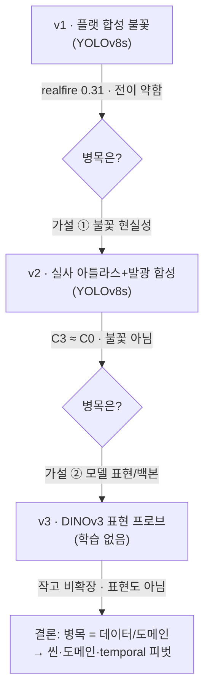
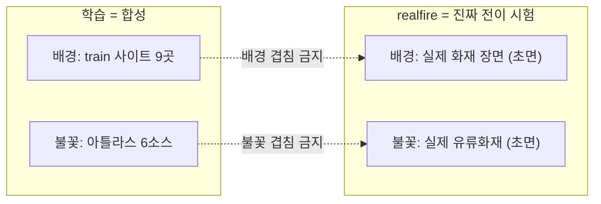
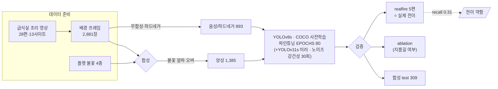
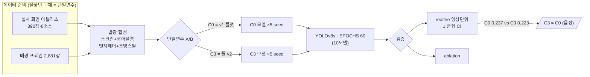
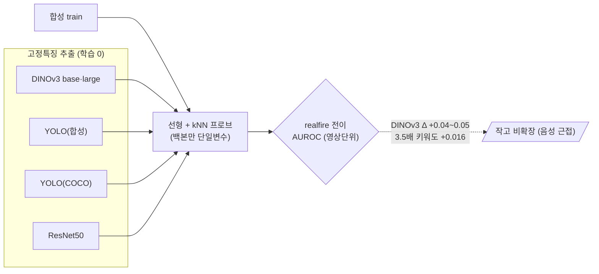
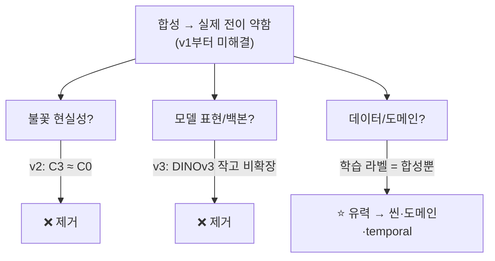

# 상세 — 급식실 화재 인식 PoC (v1 → v2 → v3)

> [요약(SUMMARY_meeting.md)](SUMMARY_meeting.md)에서 넘어온 상세 서사. 결정의 *근거 원본*은 [PREREGISTER_v2](PREREGISTER_v2.md)·[PREREGISTER_v3](PREREGISTER_v3.md)에 있고, 이 문서는 **읽어 내려가는 전체 흐름**이다.
>
> 목차: [로드맵](#roadmap) · [데이터](#data) · [v1](#v1) · [v2](#v2) · [v3](#v3) · [최종 결론](#conclusion)

---

## 1. 로드맵 한눈에

세 번의 시도는 "합성으로 배운 게 실제 불에 왜 약한가?"의 병목을 한 축씩 지워온 과정이다.

[↑ 목차](#top)

---

## 2. 데이터

### 원본
| 원본 | 내용 |
|---|---|
| 급식실 조리 영상 | **28편 · 13개 사이트**(학교 급식실 등, CCTV 2대 포함) → 배경 프레임 **2,881장** |
| 불꽃 소재 | v1 = **플랫 4종** / v2 = **실사 화염 아틀라스 390장·8소스**(스톡 화염) |
| 실제 화재(realfire) | **유류/주방 화재 영상 5편** — 학습에 전혀 안 쓴 실제 불 |

### 분할 (합성 이미지)
| 세트 | 합계 | 양성 | 하드네거 | 음성 |
|---|---|---|---|---|
| train | **2,278** | 1,385 | 335 | 558 |
| val | **294** | 171 | — | 123 |
| test | **309** | 173 | 49 | 87 |

- 사이트 분할: **train 9사이트 / val 2사이트(로봇고·인화여중) / test 2사이트(개원중·내곡중, CCTV 2대)**
- 아틀라스(불꽃) 분할: **train 348장(6소스) / test 42장(2소스 held-out)**
- realfire 5편 fire/nofire 프레임: jikken 88/86 · tokyo 60/46 · kanetsu 66/78 · grease 46/34 · hisomu 26/0

### 왜 이 비율인가 (핵심)
**이미지 비율(2,278/294/309 ≈ 88/11/12)은 "목표 비율을 정한" 게 아니라 사이트 분할의 결과다.**
- **왜 사이트 단위로 자르나** — 이미지를 무작위로 나누면 같은 주방이 train·test에 섞여 **배경·조명을 외우는 누수**가 생겨 성능이 부풀려진다. 사이트로 잘라야 "처음 보는 주방"에서의 진짜 일반화를 잰다.
- **왜 test가 개원중·내곡중인가** — 실제 배포가 **CCTV** 환경이라, CCTV 2대가 있는 이 두 사이트를 test로 둬 **배포에 가장 가까운 조건**을 시험한다.
- **아틀라스 348/42(≈89/11)** — 이미지 비율에 맞춰 **불꽃 소재 재사용을 균형**(train ~3.9×·test ~4.4×). train-heavy는 의도(v2 목표 = 학습 불꽃 다양성↑). **진짜 held-out은 realfire.**

### 누수·착시 차단 (두 축 모두 초면)

학습에 쓴 **배경도 불꽃도** realfire와 겹치지 않게 해, "같은 텍스처 다른 배경" 착시를 원천 차단한다.

[↑ 목차](#top)

---

## 3. v1 — 플랫 합성 불꽃

### 파이프라인

### 한계
- **실제 전이 약함 — realfire recall 0.31(하한).**
- ablation 통과(불꽃 지우면 검출 0.81 → 0.005) = **배경 지름길 아님** → 병목 = **합성 불꽃 종류가 적고 덜 닮음**(4종 과적합; 거대불꽃 hisomu 0.04).
- 노이즈 강건성을 키워도 실제 전이는 개선 안 됨. 학습에 안 본 실제 장면(OOD)의 사람을 불로 오인(헛불).

[↑ 목차](#top)

---

## 4. v2 — 실사 아틀라스 + 발광 합성

### 파이프라인

### 한계 (음성 — 가설 기각)
- **C3 ≈ C0** (realfire 0.237 vs 0.223, Δ −0.014) → **불꽃의 현실성·다양성은 병목이 아니었다.**
- ablation 통과(모델이 불꽃을 0.94로 제대로 씀) → 음성은 "모델 망가짐"이 아니라 **"진짜 전이 실패"**.
- realfire 5영상뿐 → CI 큼(작은 효과는 배제 못 함).

[↑ 목차](#top)

---

## 5. v3 — DINOv3 표현(백본) 프로브

무거운 탐지기 재구축 전에 "표현 교체가 전이를 고치나"만 **학습 없이 싸게** 선검증.

### 파이프라인

### 한계 (음성에 가까움)
- DINOv3 신호는 **실재하나 작음**(kNN ~0.65로 유일하게 우연 초과 = 진짜 신호), **Δ +0.04~0.05로 기준(+0.10) 미달**.
- **모델 3.5배(base→large) 키워도 realfire +0.016뿐 = 스케일 무반응** → **표현 축도 전이 병목의 레버가 아님.**
- 프로브 = 분류 proxy · realfire N=5 → 공식 판정은 보류, 실질 결론은 위와 같음.

[↑ 목차](#top)

---

## 6. 최종 결론 — 병목 제거 논리

- **핵심 문제(합성 잘함 / 실제 전이 약함)는 v1·v2·v3를 관통해 그대로.**
- 병목 후보 2개 제거: **불꽃 현실성(v2)**, **모델 표현/백본(v3)**.
- **근본 진단**: 학습 라벨이 **합성뿐**이라 어떤 모델도 합성에 없는 실제 화재 단서를 못 배운다 → **병목은 모델이 아니라 데이터/도메인.**
- **다음 방향**: 씬·도메인갭 · temporal.

### 정직한 경계
- realfire 영상 5개 → 검정력 낮음(방향 지표).
- 급식실 **실화재** 자료 부재 — synth와 realfire를 **삼각측량**하는 것이지 직접 증명 아님.
- v3 프로브는 **분류 proxy**(최종 탐지 성능 아님).

[↑ 목차](#top) · [요약으로](SUMMARY_meeting.md)
