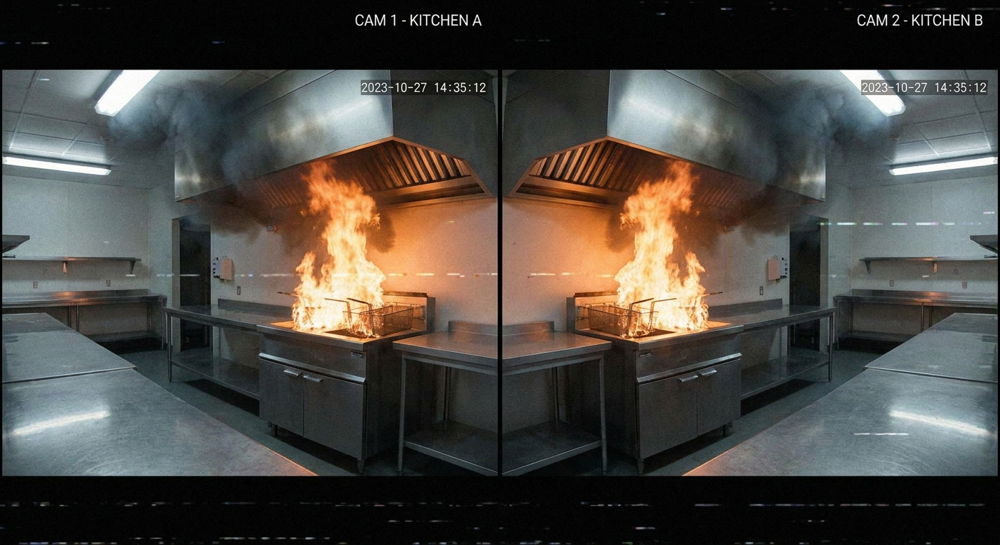
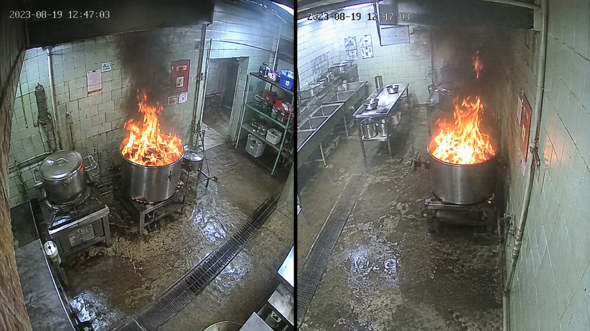

# 2026-08-26 팀원 미팅용 — 발표 준비 · 도메인 갭 지도 & 피드백 반영

> **이 문서만 따로 두는 이유:** 기존 문서들은 "합성 무기여 → **합성 제외**"로 결론냈다.
> 이번 발표 준비는 관점이 다르다 — **발표 목적상 "합성→현실 전이"를 포기하지 않고**,
> 시도할 수 있는 도메인 갭 개선책을 exhaustive하게 돌려 "무엇이 되고 안 되나 지도"를 그린다.
> 두 관점을 한 문서에 섞으면 "합성 버렸다는 거야 아니라는 거야?"로 혼란스러워지므로 분리한다.
> **모순 해소는 §3 참고**(결과는 그대로, 발표를 위한 exhaustive map일 뿐).

---

## 1. 프로젝트 목표 재정의 = **발표** (연구·배포 아님)

- 목표는 **"이런 과정을 거쳐 이런 성능을 냈다"는 과정·수치 중심 발표**. 연구회/학회급 고수준 아님.
- 따라서 **recall 0.9 같은 목표치가 아님.** 실데이터로 이미 0.85를 냈고, 그게 목표가 아니다.
- 진짜 결과물 = **"주어진 제약(실 급식실 화재 데이터 부재·시간)에서 시도할 수 있는 도메인 갭 개선책을 다 시도해본 여정과 그 지도."**
- 그래서 **negative 결과도 자산**이다 — "이것도 해봤는데 안 됐다"가 곧 발표 컨텐츠.

---

## 2. 핵심 결과물 = 도메인 갭 지도 (무엇이 갭을 닫고 못 닫나)

| 시도 | 결과 | 도메인 갭에 효과? |
|---|---|---|
| 합성 불꽃 현실성·다양성 (v2: C0 컷아웃 vs C3 발광) | C3 ≈ C0 (Δ−0.014) | ❌ 효과 없음 |
| 표현 축 (v3: DINOv3 프로브) | GO 근처도 못 감 | ❌ 효과 없음 |
| **실데이터 학습** (실험 A) | 합성 0.24 → 실 0.85~0.90 | ✅ **효과 큼 (recall 해결)** |
| 합성 + 실 **혼합** (실험 A) | 혼합 = 실-only | ❌ 효과 없음 (합성 기여 0) |
| 합성 **커리큘럼** (#2: 사전학습→실 파인튜닝, 2026-08-26) | recall 무개선(0.813=0.813)·fpr_급식실 악화(0.26→0.41) | ❌ 효과 없음 (순서도 무기여·1-seed) |
| 조리 하드네거 (⑤) | fpr_급식실 0.26 → 0.03 (10×) | ✅ 효과 있음 (헛불↓) |
| 시간축 2-of-3 | 조리 헛경보 6×↓ | ✅ 효과 있음 (헛불↓) |
| per-site 보정 | 교차-주방 헛불 관리 | ✅ 효과 있음 (현실 경로) |
| 모델 교체 (yolo11s ← v8, #1 · 1-seed 1회) | recall 0.833/scene 0.874 (v8 0.813/0.846) · fpr_급식실 0.387 (악화) | ❌ 효과 없음 (모델은 레버 아님 · 다른 운영점 · seed 미확정) |
| 공개 사전학습 모델 (baseline) | 우리 도메인 recall 0.14 | ❌ 효과 없음 (전이 안 됨) |
| D-Fire 실데이터 추가 (2026-08-26) | recall 무개선 (0.805 vs 0.813) | ❌ 효과 없음 (양 아닌 도메인) |

**한 줄:** 불꽃(v2)·표현(v3)·합성 혼합·합성 커리큘럼(#2)·모델 교체(yolo11)·공개모델·일반 실데이터(D-Fire)는 갭을 못 닫았고, **닫은 것은 실 in-domain 데이터 + 조리 특화 음성 + 시간축**이다. → **병목은 "데이터 양·모델·불꽃 품질"이 아니라 도메인 매칭.**

### 도메인 매칭이란? (급식실 화재 기준 예시)

"도메인 매칭" = **학습에 쓴 데이터가 실제 배포 현장(급식실 주방)을 얼마나 닮았느냐.** 아래 축들이 닮을수록 전이가 잘 되고, 어긋나면 실패한다.

| 축 | 우리 배포 현장(급식실) | 어긋난 데이터 예 |
|---|---|---|
| **불 종류·외형** | 튀김유(기름)불 — 팬 위로 얕고 넓게 퍼지는 주황~푸른 화염 | 산불·장작불·건물불 (색·형태 다름) |
| **불 크기·거리** | CCTV라 불이 화면을 크게 채움(가까움) | 멀리 있는 작은 불·연기 기둥 (산불 감시) |
| **장면·배경** | 스테인리스 대형 솥·조리로봇 팔·밝은 산업용 형광등·급식실 타일 | 숲·거리·가정 주방 |
| **카메라·화질** | 천장 고정 CCTV·저해상·압축 | 고해상 스톡·유튜브 영상 |
| **헷갈림 요소**(불 아닌데 불 같은 것) | 조리 스팀·주황색 튀김음식·스테인리스 반사 | 이런 게 아예 없음 (→ 헛불의 주범) |

→ **왜 각 시도가 되고 안 됐는지가 이 표로 설명된다:**
- **공개모델**(산불·실외 학습) → 불 종류·장면·헷갈림요소가 다 어긋남 → 큰 불도 놓침(0.14).
- **합성**(작은 불꽃 스프라이트를 배경에 얹음) → 불 크기·외형이 어긋남 → 화면 채우는 큰 불 못 잡음.
- **실 in-domain 데이터**(실내 실화재·유류불) → 위 축들을 상대적으로 잘 덮음 → 전이 성공(0.85).
- **남은 헛불**(조리 스팀·불색 음식) → "헷갈림 요소" 축이라, 급식실 조리 영상을 음성으로 학습(⑤)해야 닫힘.

---

## 3. "합성 제외" vs "합성 재시도" — 모순 아님

- **기존 결론(유효·불변):** 단순 혼합 합성 = 무기여, 불꽃 현실성/다양성 = 레버 아님. → **배포·성능 관점에선 합성 제외가 맞다.**
- **이번 발표 관점(추가):** 발표 가치는 "시도의 폭". 그래서 합성을 **아직 안 해본 방법(커리큘럼·표적·생성)으로도** 돌려 지도를 완성한다.
  - "합성이 될 거라 믿어서"가 **아니다.** 발표에서 **가능한 방법을 빠짐없이 시도했음**을 보이고, **실데이터가 얇은 잔여(창백 초기불)에 합성 니치가 있나만 반증 가능한 방식으로** 확인하는 것.
- **결론:** 결과(합성 무기여)는 그대로 두고, **발표를 위해 빠짐없는 전체 지도를 그린다.** 배포 결론은 여전히 실데이터. → 모순 아님.

---

## 4. 배찬우 팀원 테스트셋 검수 반영 (`fire_realtest_review.md`)

배찬우 팀원이 `oilfire_realtest_share.zip`(841장) 전수 육안검수 후 진단서 제출. **채택할 것과 정정할 것을 구분한다.**

### ✅ 채택
- **presrc `sc10` 오라벨 = 진짜 라벨버그** (발화전 음성인데 웍 불꽃) → fpr_발화전 부풀림. **presrc 전수 재검수 ✅완료(크로스체크), 결과=오염 광범위 → 처리는 §반영실행 A안(de-emphasize).** (fpr_발화전은 **부차지표** — 배포 지표는 fpr_급식실, 배포 결론 불변)
- **recall clean/all 이중집계** 제안 타당(투명성).
- nofire_kitchen 품질 좋음·"이 셋 recall이 병목 아님" = 우리 결론과 일치.
- **(부차) 배찬우 팀원 관찰 인정:** sc02는 검출은 되나 방 전체 불바다라 급식실 스케일과 다름(6프레임·영향 미미)·presrc에 토킹헤드/타이틀카드(sc01·04·08) 섞여 "조리 헛불" 셋으로는 희석(부차지표라 무해).

### ⚠️ 정정 (발표에 그대로 쓰면 안 되는 과장·미끄러짐)
- **"recall 낮음 = 테스트 탓" 과장.** 검수한 "compromised" 장면 **대부분을 우리 모델은 이미 잘 잡는다**: sc11 0.85·sc13 0.72·sc09 0.82·sc02 1.0. recall을 끌어내리는 건 **sc14·sc15(NIST 창백/소형불)뿐**이고, **sc14는 배찬우 팀원도 clean이라 인정** → **진짜 검출기 약점**이지 테스트 오염 아님. 이중집계해도 recall은 거의 안 오른다. (배찬우 팀원이 flag한 6장면 중 실제로 낮은 건 **sc15 하나** — 단 **이후 실험서 sc15는 민감 모델(yolo11 0.938·2curr 0.875)이 검출** → "그래프 가림"이 아니라 **창백/경계불**로 밝혀짐, 즉 compromised 아니라 검출기 민감도 문제)
- **주의 — "0.3 = 오염 탓"에서 "합성이 괜찮았다"로 미끄러지지 말 것.** 그 realfire 0.31이 오염 영향을 받은 건 **사실**이다(우리 기존 진단 "realfire 절대값 신뢰불가"와 일치 — 이 점은 배찬우 팀원이 맞음). **하지만 합성의 전이실패는 별개로 실재** — 깨끗한 test서도 합성 0.36 vs 실 0.85. → **"오염만 고치면 합성도 전이됐을 것"은 틀림.** 발표에선 "0.3 = 오염 + 합성 전이실패, 실데이터로 0.85"로.
- **체리피킹 방지 기준:** 제외는 **"불을 가리는 비-배포 아티팩트"만**(타이틀카드=불 없음·그래프/텍스트가 불꽃을 덮음). **저화질(sc09)·자막(sc11)은 불 보이면 유지**(급식실 CCTV도 저화질=배포 대표). "모델이 못 잡았으니 제외"는 금지.

### 반영 실행 (결정 기록)

**① presrc = A안 de-emphasize 확정 (2026-08-26).**
- **크로스체크 완료:** `colab_inspect_presrc.py`로 sc00~09 몽타주 전수 검수 + sc00은 원본영상 직접 확인. **배찬우 팀원·사용자 두 검수자 판정 거의 완전 일치.**
- **확증 = presrc 체계적 오염:** RANGES를 메인 불에 늦게 잡아 **초기 발화/깜빡임이 발화 전 프레임에 샘.** 증거—sc00 원본서 **2:38 발화 시작**인데 RANGES는 **2:40**(마지막 presrc 프레임이 발화 걸침). 유형: **경계형**(sc00·02·04·05·06·07=RANGES 직전만)·**초기/전체형**(sc03 8s부터·sc09 CCTV 전체). 깨끗=sc01·sc08.
- **처리: presrc 신뢰불가로 제외, 헛불은 깨끗한 `fpr_급식실`(배포 지표)로만 보고.**
- **★A 선택 이유(기록): 발표 임박 + `fpr_발화전`은 부차지표(배포 지표 아님) → A가 효율·정직 둘 다 우위.** B안(`PRESRC_MARGIN` 재빌드로 clean 숫자)은 노력 대비 실익 적고, 마진 튜닝·잔여 애매성으로 완벽 clean도 보장 못 함. **"오염 발견하고 정직하게 제외"가 "어설픈 숫자 만들기"보다 방어적으로 강함.** 배포 결론 불변.
- **크로스체크 자체가 발표 자산:** "테스트셋을 팀 이중검증해 오염을 잡아 제외했다" = 엄밀성 신뢰도.
- `colab_realtest_eval.py`의 `PRESRC_DROP` env는 보존(원하면 언제든 B안 전환 가능). 현재 미사용.

**② recall 이중집계(`COMPROMISED_SCENES`)** = 최종 eval 시 적용(현재 미적용). **단 검증 결과 이중집계 대상이 사실상 없음** — sc14=실제 잔여 약점(창백 초기불, 검출기 약점)·sc15=민감 모델이 검출(compromised 아님). 둘 다 "불 가리는 비-배포 아티팩트"가 아니므로 제외 대상 아님 → **이중집계해도 recall 거의 불변**(체리피킹 금지 원칙 자체가 "뺄 게 없음"으로 귀결). 투명성 차원의 옵션으로 보존.

---

## 5. 2026-08-22(토) 멘토링 피드백 선별

| 항목 | 적용 | 방식/이유 |
|---|---|---|
| 디버깅: 감지 잘된/안된 확인→약점 판단 | ✅ 완료 | 셀2b·diag·장면별 recall. 약점=창백불·조리FP. **단 "잘되는 것만 합성"은 편향악화라 역방향** |
| epoch별 val/train loss | ✅ 완료 | ultralytics 자동 로깅 |
| 프레임 중복 | ✅ 완료 | dHash 그룹분할(누수 73%→0) |
| 에폭 재설정(6 등) | ✅ 측정 | 과적합 아님(patience+best.pt). "6"은 과소적합이라 부적용 |
| 합성 퀄리티↑ | ✅ 답 나옴 | v2에서 C3≈C0=무효(negative) |
| 데이터 다양성/양↑ | ✅ 시도 | A안·D-Fire → 일반 데이터 추가는 무효(양이 아니라 배포 현장(급식실)을 닮은 데이터인지가 관건) |
| baseline 모델 교체 (yolo8/yolo11) | ✅ 완료 | yolo11 1-seed 관측: 다른 운영점(recall↑/fpr↑)·seed-robust 미확정 → 모델은 레버 아님(§2·§6.3) |
| 생성형(nano-banana·gpt-image) | 🟡 진행 중 | **nano-banana pro <u>사비로 결제(￦29,000 ㅠㅠ)</u>** · 이미지 생성 제한 약 70장/일 Codex image 생성 · 전이 개선 미확정(측정 예정·#6) |
| Roboflow | 🔵 저순위 | 추가 실데이터원(D-Fire negative라 후순위) |
| Label Studio | ⚪ 불필요 (안 써도 됨) | 현재 frame-level(폴더=라벨) |
| 소벨/누끼·edge·"색상 중요" | 🔵 저순위 | 색상이 오히려 FP 원인(불색 음식). YOLO 이미 학습 |
| **validation = test 동일** | 🔴 **금지** | **누수.** 의도(실 val·합성이 문제)는 이미 반영 |

**요지:** 미팅 피드백의 ~7할은 **이미 반영됐거나 우리 실험이 negative로 답을 냈다.** 발표에선 "피드백을 체계적으로 반영·검증했다"로 쓴다.

### 생성형 도구 샘플 · 1×2 그리드 방식

| nano-banana pro | Codex (GPT image) |
|:---:|:---:|
|  |  |

**왜 1×2 그리드로 생성하는가?**
- nano-banana pro의 **이미지 생성 제한(약 70장/일)** → **1×2 그리드로 생성** → **슬라이싱**(가운데 seam 자동 분리, [`slice_grid.py`](../scripts/slice_grid.py)) → **한 번 생성으로 데이터 양 2배.**
- 슬라이싱 정합·데이터 중복(near-dup) 검증에서 **문제가 없었기에 이 방식을 채택.** (그리드 두 패널은 같은 주방의 다른 각도라 mild 유사하나, 슬라이스 후 개별 라벨링 + dHash 근접중복 제거로 통제. 도메인 톤은 CCTV·grainy로 고정, 장면·배경·불 크기는 프롬프트로 변주.)

**두 생성기 데이터 비율 — 5:5일 필요 없음**
- **생성 방식이 다르다:** nano-banana pro와 Codex(GPT image)는 서로 다른 *attractor*(모델이 수렴하는 시각 모드)를 가진다 — nano-banana pro는 밝은 파란 스테인리스 톤, Codex는 따뜻하고 낡은(기름때) 톤으로 수렴하는 경향. 즉 **같은 프롬프트라도 서로 다른 분포의 이미지**를 낸다.
- **그래서 섞으면 좋다:** 두 생성기를 섞으면 **프롬프트 변주만으로는 못 얻는 다양성**(생성기 간 분포 차이)이 생긴다. 덤으로 nano-banana pro의 일일 한도도 우회.
- **비율은 5:5가 아니어도 된다:** 사전학습 풀에서 중요한 건 **총 다양성 + 큐레이션 품질**이지 생성기 간 균형이 아니다(양성/음성 클래스 균형과는 다른 문제). **도메인 매칭이 좋은 쪽 + 뽑히는 만큼**으로 자연스럽게 두면 되고, **한쪽이 극단적으로 지배(9:1 이상)하지만 않으면** 무방하다.

---

## 6. 앞으로 할 실험 = 발표 컨텐츠 (도메인 갭 개선 방안을 다 시도해 지도 완성)

**접근(합의):** 발표 목적 = "합성→현실 전이의 도메인 갭 개선을 **시도할 수 있는 만큼 다 해보고** 그 지도를 보여주기". → 방안을 **비용순으로 나열해 가벼운 것부터 하나씩 실행, 각 결과를 §6.3 로그에 누적.** 대부분 negative 예상이나 **"이것도 해봤고 안 됐다"의 기록 자체가 발표 컨텐츠.**

### 6.1 선행 — 배찬우 팀원 검수 반영 (측정 신뢰도 보정 · 스크립트 준비됨)
- `colab_inspect_presrc.py`(신규) → presrc 장면별 몽타주 → 불꽃 오라벨 장면 식별.
- `colab_realtest_eval.py` 에 `PRESRC_DROP`(오라벨 장면 fpr서 제외) · `COMPROMISED_SCENES`(recall clean/all 이중집계) 추가. **파일 삭제 없이 eval 시점 필터**(안전).
- sc14/sc15 몽타주 검증 → sc14는 검출기의 실제 잔여 약점(창백 초기불)으로 남김(숨기지 않고 명시).

### 6.2 도메인 갭 개선 방안 (비용순 · 가벼운 것부터)

| # | 방안 | 비용 | 사전확률(미확정) | 상태 |
|---|---|---|---|---|
| 1 | **yolo11로 baseline 교체** | 낮음 | ~ | ✅ **완료** → §6.3 (v8≠v11, 다른 운영점) |
| 2 | **커리큘럼** (합성 사전학습 → 실 파인튜닝) | 낮음(학습1회) | 낮음 | ✅ **완료** → §6.3 (갭 못 닫음: recall 무개선·fpr 악화) |
| 3 | **엣지/색상 전처리** (소벨 채널) | 낮~중 | 낮음 | 대기 |
| 4 | **합성 도메인 랜덤화** (장면·스케일·조명 다양화) | 중 | 낮음(단 미시험 축) | 대기 |
| 5 | **표적 합성** (창백 초기불 sc14 겨냥) | 중 | 낮음~약양성 | 대기·니치 |
| 6 | **생성형 합성** (nano-banana/gpt-image → Seedance 영상 → 프레임) | 높음 | 낮음(단 컴포지팅과 다른 방법·미시험) | ★**채택 확정(실행)** |
| 7 | (선택) **도메인 적응** (DANN/MMD 특징정렬) | 높음(구현) | 낮~중 | 대기 |

> ⚠️ "사전확률"은 **추론이지 결과 아님.** yolo11이 사전예상("≈")을 빗나갔듯 **사전확률 낮다고 스킵하지 말 것** — 여지 있으면 다 돌려본다(사용자 원칙).

**실행 원칙:** 비용순(2→7) 하나씩. 각 방안 = 새 모델 → **eval 은 맨 마지막에 1회**(전 모델 동시, 보정 test). 모델은 Drive 저장이라 세션 넘어도 남음.

**#6 생성형은 채택 확정**(비용순대로면 뒤지만, 원하면 우선 착수 가능·설계논의 필요). 시간 부족해도 #6은 남김.

### 6.3 실험 로그 (실행하며 누적 — 이게 발표의 "지도 확장판")

| 방안 | 결과 (같은 실 proxy test·conf 0.25) | 판정 |
|---|---|---|
| **#1 yolo11s 베이스** (2026-08-26·**1-seed 1회**) | recall 0.833/scene 0.874 (v8 0.813/0.846) fpr_급식실 0.387 (v8 0.260) sc15 0.438→0.938 | **측정(이 run):** 위 수치. **추정(1회):** 다른 운영점으로 "보임"(v11 더 민감 recall↑/fpr↑) — 단 1-seed라 seed-robust 미확인, 작은 recall차는 학습변동 가능. **미확정:** "더 낫다/일반적으로 더 민감" = 다중seed·conf-matched 필요(고비용→안 함). → 사전예상("≈") 빗나감. |
| **#2 커리큘럼** (합성 v8_C0_s1 사전학습→실 파인튜닝 2026-08-26·**1-seed 1회**) | recall 0.813 = 2g 0.813 scene 0.852 (2g 0.846) **fpr_급식실 0.409 (2g 0.260·악화)** sc15 0.438→0.875 vs 약점 sc14 0.175→**0.100** | **측정:** recall 무개선 + fpr_급식실 악화(0.260→0.409). scene +0.006은 개선 아닌 **재분배**(sc15↑를 sc01·03·07·09·10·**sc14** 하락이 상쇄, 약점 sc14 오히려 악화). **시사:** 더 민감한 운영점으로 보임(fpr↑ + 경계장면 sc15↑ 동반, y11과 유사 패턴) — 진짜 개선 아님. **미확정:** 1-seed(변동가능)·fpr N=181(CI 큼)·conf-matched 안 함(→"일반적으로 더 민감" 단정 불가). **판정 = 갭 못 닫음.** 혼합(무기여)에 이어 커리큘럼(순서)도 무효 재확증. 단 out-of-domain 합성이라 **#6(도메인매칭 생성형)은 예단 못함.** *(부기: fpr_발화전 −0.086은 presrc 오염·부차라 미반영. 배관 end-to-end 검증됨 → #6은 BASE만 교체.)* |

> 기록 원칙: **확정(측정·조건한정) / 시사 / 미확정** 구분. "안 됨/더 낫다" 단정 금지.

### 6.4 생성형 합성(#6) — 설계·프롬프트·파이프라인 (진행 중, 2026-08-26)

**결정(합의):** 도구 = Google AI Studio · Nano Banana Pro + Codex(GPT image). (한도·비용 = §5 참고)

**무엇을 생성할 것인가?** 급식실/상업주방 + CCTV 각도 + 유류불(도메인 통합, "예쁜 불꽃" 아님). **라벨** = 수동 박스(Roboflow → YOLO export, class0=fire). **학습** = 커리큘럼(생성-합성 사전학습 → 실 파인튜닝, 배관은 #2로 검증됨).

**★현재 진행 중:** [`gen_prompts.md`](gen_prompts.md) **프롬프트 템플릿**(고정 도메인 앵커 + 변주 슬롯 = 주방·각도·용기·조명·불크기)으로 생성.

- **ⓐ 크기 스펙트럼** — 소형40 / 중간40 / 큰불20 (소형 = 우리 약점 sc14 겨냥 · `strong flames` 도배 금지 = §8 편향)
- **ⓑ 유류불 판별** — `an uncontrolled oil/grease fire ... from the oil surface, with smoke` (정상 조리화염과 헷갈리면 검수에서 제외)
- **ⓒ near-dupe 방지** — 같은 프롬프트 재실행 금지 · 타임스탬프·각도·용기 변주
- **ⓓ 슬라이스·저장** — 단일은 그대로, 1×2 그리드는 [`slice_grid.py`](../scripts/slice_grid.py)로 슬라이스(검은띠·캡션·gutter 자동제거) 후 라벨. 저장 = 그리드/단일만 분리(장면종류 무관·파일명 고유) → Roboflow 불꽃 박스 → YOLO export(zip)

**★다음 세션:**

- **ⓐ gen 데이터 빌더** — 하위폴더 재귀 → YOLO 데이터셋(폴더명 접두어로 파일충돌 방지)
- **ⓑ 커리큘럼** — gen-synth 사전학습 → `BASE_YOLO`=그 모델로 실 파인튜닝(split_audit) → `real_only_grouped_gencurr`
- **ⓒ eval** — `2gencurr` 추가 → 실 proxy로 2g 대조. **판정: 2gencurr ≈ / > / < 2g**
- *(이미지 좋음 = 필요조건, 전이 개선은 미확정 = 측정할 것)*

**10 프롬프트 세트 (공통 앵커: CCTV·감시·저해상·grainy·형광등, 극적불 회피):**
1. 학교급식실·웍·중간불·천장: `...high angle from the kitchen ceiling looking down, industrial school cafeteria kitchen, a large stainless steel wok on a commercial gas stove, cooking oil on fire with medium orange and yellow flames, ... timestamp overlay, no people`
2. 병원주방·튀김기·큰불·측면각: `...high side angle, hospital institutional kitchen, a stainless steel deep fryer on fire with large intense orange flames and dark smoke ...`
3. 단체급식·큰솥·초기작은불·코너어안: `Wide fisheye CCTV ... ceiling corner, institutional catering kitchen, a large stainless steel cooking pot ... small orange flames and light haze, timestamp overlay`
4. 상업레스토랑·프라이팬·중간불·눈높이+음식: `...eye-level angle, commercial restaurant kitchen, a frying pan with food and cooking oil on fire ... some steam nearby ...`
5. 산업구내식당·웍·큰불·천장+연기: `...from the ceiling looking down, large industrial canteen kitchen, a big stainless steel wok on fire with large orange flames and thick dark smoke rising toward the exhaust hood ...`
6. 학교급식실·튀김바구니·초기불+스팀·높은각: `...high angle, school cafeteria kitchen, a stainless steel deep fryer basket with cooking oil beginning to catch fire, small orange flames and rising steam and vapor ...`
7. 병원주방·큰솥·중간불·어안+**조리로봇**(배포 도메인): `Wide fisheye CCTV ... institutional hospital kitchen, an industrial robotic cooking arm next to a large stainless steel pot on fire with medium orange flames ... timestamp overlay`
8. 상업주방·웍·큰불·측면각·야간: `...at night, high side angle, dimly lit commercial kitchen, a stainless steel wok on fire with large bright orange flames illuminating the dark kitchen ...`
9. 단체급식·프라이팬·발화순간·천장+기름/음식: `...from ceiling, institutional catering kitchen, a large frying pan full of cooking oil and food just igniting, small orange flames spreading across the oil surface ...`
10. 산업주방·튀김기·중간불·광각·젖은바닥: `Wide angle CCTV ... industrial kitchen, a stainless steel deep fryer on fire with medium orange flames ... wet tiled floor reflecting light ... timestamp overlay, no people`

> 각 프롬프트 전문은 세션 대화(2026-08-26)에 있음. 다양성 위해 프롬프트 단어(주방·불크기·팬·각도)를 바꿔야 함(같은 프롬프트 반복=미세변형만). ⑦(조리로봇)이 실 배포 도메인에 가장 근접.

---

## 7. 발표 서사 골격 (정직 버전)

1. **문제:** 급식실 조리로봇 화재 감지. **실 급식실 화재 데이터는 못 구함**(불 못 냄).
2. **합성으로 시작 → 실제 전이 실패** (같은 test 합성 0.36). 불꽃 현실성 올려도(v2) 무효, 표현(v3)도 무효 → **병목 = 도메인 갭.**
3. **실데이터가 레버** → recall 0.85. 합성 무기여.
4. **진짜 병목 = 조리 헛불** → 하드네거 10×·시간축 6×·per-site.
5. **확증:** 공개모델 미전이(0.14)·D-Fire 무효 → **병목은 데이터양/모델/불꽃품질 아닌 도메인·특화음성.**
6. **정직한 한계:** 실 급식실 화재 부재(삼각측량)·창백 초기불(sc14)·범용화(교차-주방).

→ 발표 한 문장: **"합성을 여러 방식으로, 공개모델·실데이터 보강까지 — 시도할 수 있는 도메인 갭 개선책을 다 돌려 지도를 그렸고, 레버는 실 in-domain 데이터 + 조리 특화 음성 + 시간축이었다."**

---

## 8. 하지 말 것 (발표 방어용 — "이렇게 하면 안 됨도 확인")

- **val = test** (누수) — 발표에선 "이건 누수라 안 했다"로 언급.
- **"잘 되는 데이터 특징만 합성"** — 기존 편향 악화(역방향). 못 잡는 걸 모아야 함.
- **"0.3 = 오염 탓"** 오귀속 — 0.3은 합성 전이실패가 주원인.
- **생성영상을 "실검출 시연"으로** — AI 생성불꽃=실사 아님, sim2real 논란 재발. 삽화만.
- **compromised 제외로 recall 부풀리기** — 체리피킹. 불 보이면 유지, sc14 약점은 정직하게 남김.

---

*관련 문서: 미팅이후 전체 = [AFTER_meeting.md](AFTER_meeting.md) · 팀보고 = [STATUS.md](STATUS.md) · 재현·스크립트 = [HANDOFF.md](HANDOFF.md). 배찬우 팀원 검수 원본 = `fire_realtest_review.md`(사용자 로컬).*
