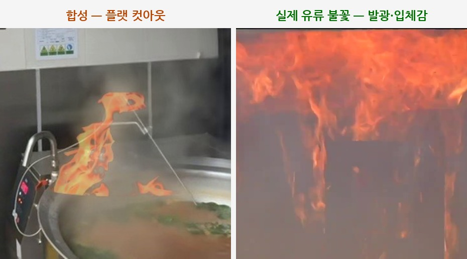
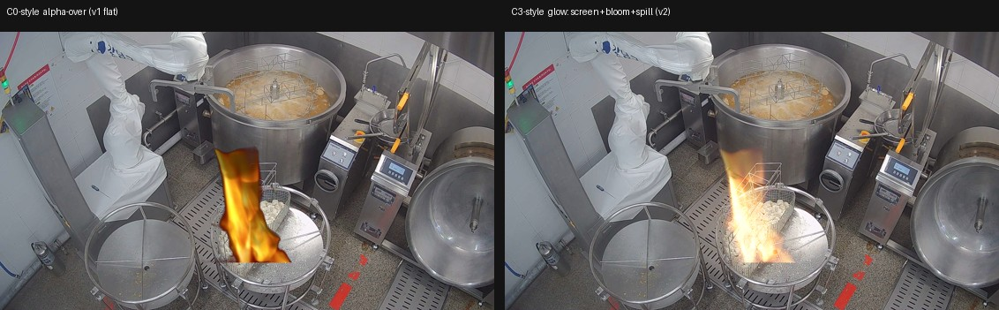

# 급식실 화재 인식 PoC — 전체 요약 (미팅용, 2026-08-22)

> 합성 화재로 학습해 **실제 화재를 인식**하는 검출기를 만들 수 있나? v1→v2→v3 세 시도의 데이터·파이프라인·한계·결론.
>
> 📖 **파이프라인 도식·전체 흐름이 있는 상세 서사 → [DETAIL.md](DETAIL.md)** ([로드맵](DETAIL.md#roadmap) 도식부터)

---

## 1. 데이터

### 원본
| 원본 | 내용 |
|---|---|
| 급식실 조리 영상 | **28편 · 13개 사이트**(학교 급식실 등, CCTV 2대 포함) → 배경 프레임 **2,881장** 추출 |
| 불꽃 소재 | v1 = **플랫 4종** / v2 = **실사 화염 아틀라스 390장·8소스**(스톡 화염, `assets/flamelib`) |
| 실제 화재(realfire) | **유류/주방 화재 영상 5편**(jikken·tokyo·kanetsu·grease·hisomu) — 학습에 전혀 안 쓴 실제 불 |

### 학습 데이터 구성 (합성 이미지)
학습(train)·검증(val)·시험(test) 세 묶음으로 나눔:

| 묶음 | 합계 | 양성(불 있음) | 하드네거 | 음성(불 없음) |
|---|---|---|---|---|
| train (학습) | **2,278** | 1,385 | 335 | 558 |
| val (검증) | **294** | 171 | — | 123 |
| test (시험) | **309** | 173 | 49 | 87 |

- **양성** = 배경에 불꽃 합성(불 있음) · **음성** = 불 없는 배경 그대로 · **하드네거** = 불은 없지만 **헷갈리기 쉬운 장면**(붉은 음식·김·밝은 불빛 등, 오탐을 걸러내는 시험용).
- 불꽃 소재도 학습용/시험용으로 나눔: **train 348장 / test 42장**(시험용 42장은 학습에 한 번도 안 쓴 소재).
- **realfire(진짜 화재 영상 5편)** 는 위 합성과 별개 — 학습에 전혀 안 쓴 실제 불로, **최종 시험**에만 사용.

### 데이터를 이렇게 나눈 이유 (제일 중요 — "몰래 외우기" 차단)
1. **주방(사이트)별로 나눔** — 같은 주방이 학습·시험에 겹치면, 모델이 불이 아니라 **그 주방 배경을 외워버려** 성적이 부풀려짐. 그래서 주방 단위로 잘라 **"처음 보는 주방"에서만 시험**한다.
   - 학습 9개 주방 / 검증 2개 / **시험 2개(개원중·내곡중, CCTV 2대 = 실제 배포 환경에 가장 가까움)**.
2. **불꽃 소재도 나눔** — 시험용 불꽃은 학습에 안 쓴 것만. 안 그러면 "같은 불꽃 모양을 외워" **실제로 일반화한 게 아닌데 잘하는 것처럼 보임**(착시).
3. **realfire = 불꽃도 장면도 처음** — 학습에 없던 실제 불 + 실제 장면 → **"가짜(합성)로 배운 게 진짜 불에 통하나"의 진짜 시험**.

**[자세히(비율 이유·누수 차단 도식) →](DETAIL.md#data)**

---

## 2. v1 — 합성 불꽃(플랫) 검출

**파이프라인**
- **모델**: YOLOv8s(COCO 사전학습)를 우리 데이터로 파인튜닝. 결론이 한 모델의 우연이 아닌지 보려고 **YOLOv11s로도 똑같이 한 번 더 학습해 교차검증**.
- **학습 데이터 만드는 법**: 급식실 배경 사진에 **불꽃을 합성해 얹은 이미지 = "불 있음(양성)"**, 불을 얹지 않은 배경·헷갈리기 쉬운 무화재 장면 = **"불 없음(음성)"**으로 라벨링. 이 이미지들로 80번 반복 학습(EPOCHS 80).
- **노이즈 강건성 실험**: 이미지에 노이즈(흐림·저조도·압축 등)를 점점 세게 얹으며 **검출이 얼마나 무너지는지** 보고, 그 노이즈를 **학습에 넣으면 회복되는지** 확인. 통계 신뢰 위해 조건을 바꿔가며 **총 30번 학습**(2개 모델 × 3개 구성 × 5개 seed).
- **검증 3가지**: ① 처음 보는 합성 이미지에서 잘 잡나(합성 test) ② **불꽃만 지웠을 때 검출이 사라지나** — 모델이 배경이 아니라 진짜 '불'을 보는지 확인(ablation) ③ **진짜 화재 영상(realfire)에서도 되나** = 실제 전이 시험.

**한계**
- **실제 화재 인식률이 낮음** — 진짜 화재 영상에서 불을 잡아낸 비율 **약 31%**(recall 0.31 ≈ 나머지 69%는 놓침). *'하한'* = 경계·연기 가림을 엄격히 쳐서 실제론 이보다 조금 높을 수 있음.
- **배경 보고 찍는 건 아님(ablation 통과)**: 불꽃을 지우면 검출이 0.81→0.005로 사라짐 → 모델은 진짜 '불'을 본다. → 그렇다면 낮은 이유 = **학습에 쓴 합성 불꽃이 종류가 적고(4종) 실제 불과 덜 닮음**(거대불꽃 hisomu 0.04).
- 노이즈 학습으로 강건성을 키워도 **실제 화재 인식은 안 좋아짐**. 학습에 없던 실제 장면에선 **사람을 불로 오인**(헛불)하기도.

**v1이 남긴 가설 (→ v2의 출발점)**
> ablation으로 "배경 보고 찍는 게 아니라 진짜 불을 본다"가 확인됐다. 그렇다면 실제 화재 인식이 낮은 원인은 **학습에 쓴 합성 불꽃이 실제 불과 덜 닮고 종류도 적은 것**으로 좁혀진다.
> → **가설: "불꽃을 실제처럼, 더 다양하게 만들면 실제 화재 인식이 오를 것이다."** 이 가설을 검증하려고 v2(실사 아틀라스+발광 합성)를 시작했다.

**[자세히(파이프라인 도식) →](DETAIL.md#v1)**

---

## 3. v2 — 실사 아틀라스 + 발광 합성

**파이프라인**
- **모델**: 동일 YOLOv8s (v1 실험 틀 그대로 재사용).
- **바꾼 건 불꽃 하나뿐 (공정한 A/B)**: 불꽃을 **실사 화염 아틀라스 390장 + 발광 합성**(빛번짐·글로우로 실제 불처럼)으로 교체. **C0 = v1의 옛 방식(플랫 불꽃), C3 = v2의 새 방식(실사+발광)**. 배경·모델·학습은 전부 똑같이 고정 → 차이가 나면 **오직 불꽃 때문**임을 보장.
- **학습**: C0·C3 각각 5번씩(seed 5개) 총 10모델. **EPOCHS 60(학습 반복 횟수)** — 몇 번이 적절한지 미리 재보니 **55회 근처가 성능 정점이고 그 뒤론 평평** → 낭비 없이 정점을 담는 60으로 고정.
- **검증**: ① **진짜 화재 영상에서 인식률**을 재되 **영상 단위로** 집계 — 같은 영상의 프레임들은 서로 비슷해 '독립된 여러 데이터'로 치면 안 되므로, **영상 하나를 한 단위로 묶어 불확실성 범위를 계산**(= 군집 CI). ② **불꽃만 지운 이미지로 검출이 사라지나** 확인 — 모델이 배경이 아니라 진짜 '불'을 보는지 검사(= ablation).

**예시 — 실사 화염 아틀라스란?**

*왼쪽: v1의 플랫 합성 불꽃(납작한 컷아웃, ≈C0) · 가운데: 실제 유류 화재 · **오른쪽: v2가 학습에 쓰는 실사 화염 아틀라스**(실제 불 사진에서 뽑은 화염 소재). 왼쪽↔가운데 차이가 커서, v2는 오른쪽 같은 실사 소재로 그 간극을 메우려 했다.*

**예시 — 플랫(v1) vs 발광(v2) 합성, 같은 불꽃·같은 위치**

*같은 급식실 배경·같은 불꽃·같은 위치에 **렌더링 방식만** 바꿔 시연. **왼쪽 = v1 방식(플랫 알파 합성)** — 납작한 컷아웃. **오른쪽 = v2 방식(발광: 스크린+코어블룸+조명 스필)** — 밝은 코어·빛번짐·주변까지 밝아지는 조명 스필로 실제 불에 가까움. v2는 이 "발광"이 실제 화재 인식을 올릴 거라 봤으나, A/B 결과 **안 올랐음**.*

**한계 (가설이 틀렸음이 밝혀짐)**
- **새 방식(C3)이 옛 방식(C0)과 사실상 같음** — 실제 화재 인식률 **0.223 vs 0.237**(차이 −0.014로 거의 0). → **불꽃을 실제처럼 잘 만들어도 실제 화재 인식은 안 올랐다 = 불꽃의 현실성·다양성은 병목이 아니었다.**
- **모델이 고장난 게 아님(ablation 통과)**: 합성 이미지 안에서는 C3가 불을 아주 잘 잡음(불 있으면 0.94, 불꽃 지우면 0.00). 즉 모델은 멀쩡함. 그런데도 실제 화재엔 안 통함 → 낮은 이유는 "C3가 나빠서"가 아니라 **"불꽃을 아무리 잘 만들어도 실제로는 전이가 안 되는 것"**.
- **단, 실제 화재 영상이 5개뿐** → 통계적 불확실성이 큼. "큰 차이 없음"은 확실하나 "아주 작은 차이"까지 없는지는 영상이 적어 단정 못 함(더 많은 실제 영상 필요).

**실제 화재 성적 자세히 — recall(놓침)·precision(헛불)**

같은 realfire를 두 지표로 나눠 보면 (프레임 단위·5영상·seed 평균):

| 조건 | **recall** (실제 불을 잡은 비율) | **precision** (불이라 한 것 중 진짜 비율) |
|---|---|---|
| C0 (v1 방식) | **27%** | **57%** |
| C3 (v2 방식) | **24%** | **68%** |
| *참고 v1* | *31%* | *80%* |

- **recall 27%** = 실제 불 프레임 약 286장 중 **~78장만 잡음 → 나머지 ~208장(73%)은 놓침.**
- **precision 57%** = 모델이 "불이야"라고 한 약 136장 중 **~78장만 진짜 불 → 43%는 헛불.**
- **핵심: 문제는 헛불(precision)이 아니라 놓침(recall)이다.** 불이 나도 **4번 중 3번은 못 알아챈다.** C3(발광)은 헛불을 조금 줄였지만(precision 57→68%) **놓침은 못 고쳤다**(recall 여전히 ~25%).
- ※ v1의 31%/80%와 **직접 비교 금물**: 이 시험은 불:무화재 프레임이 ≈1:1이라 헛불 기회가 많아 precision이 구조적으로 낮게 나옴(정의는 같으나 표본·모델이 다름).

> **참고 — "실제 영상을 더 모으면?"(배찬우 팀원 제안)**: 배찬우 님이 데이터 다양성 보강용으로 Roboflow fire 데이터([universe.roboflow.com/search?q=fire](https://universe.roboflow.com/search?q=fire))를 공유. 실제 화재 데이터를 추가하면 위 불확실성을 줄여 *아주 작은 차이*까지 가릴 수 있다. 유효한 다음 수였지만 **실행하지 않았다** — ① 이후 v3에서 최신 모델(DINOv3)조차 개선 폭이 기준에 못 미쳐, **더 모아 정밀하게 재도 "불꽃/표현이 답"이라는 결론은 안 바뀜**(실익 낮음). ② 공유된 링크는 **일반 "fire" 검색**이라 대부분 산불·건물화재 — 우리 도메인(급식실 유류화재)과 안 맞고 **무화재 주방(헷갈리는 오탐 시험용) 이미지가 거의 없어** 그대로는 못 쓰고 골라내야 함(학습 소스로 직접 쓰면 안 되고 **검증용**으로만). → 병목이 데이터/도메인으로 좁혀진 지금은 **영상 확장보다 방향 전환이 우선.**

**[자세히(파이프라인 도식) →](DETAIL.md#v2)**

---

## 4. v3 — DINOv3 표현(백본) 프로브

**아이디어**: 지금까지 YOLO는 이미지를 이해하는 방식(**표현**)을 *우리 합성 데이터로* 처음부터 배웠다. 대신, **엄청난 양의 실제 사진으로 미리 학습된 최신 비전 모델(DINOv3)의 표현을 그대로 빌려** 쓰면 실제 불에 더 잘 통하지 않을까? — **배찬우 팀원이 제안한 방향.**

**파이프라인**
- **모델**: **DINOv3** — 실제 이미지로 사전학습된 비전 모델. 기본(base)·큰것(large) 두 크기. **추가 학습 없이, 이미 배운 특징만** 꺼내 씀.
- **YOLO와 뭐가 다른가 (기대 효과)**: 우리 YOLO는 *제한된 합성 데이터로 처음부터* 배워서 **합성 분포에 치우치기 쉽다**(그래서 실제로 잘 안 통했을 수 있음). 반면 DINOv3는 **라벨 없이 수억 장 규모의 실제 사진으로 미리 학습한 범용 비전 모델**(이른바 "파운데이션 모델")이라, 특정 과제에 치우치지 않은 **폭넓은 실제 세계 시각 표현**을 갖는다. → **기대**: 실제 사진으로 익힌 표현이니 합성 특유의 인공적 흔적에 덜 얽매이고 **실제 불에 더 잘 반응**해, 합성↔실제 간극을 *표현 수준에서* 좁혀줄 것.
- **방법**: 여러 모델(DINOv3 · 우리 YOLO · 범용 YOLO · ResNet50)에서 특징을 뽑아, **그 특징만으로 실제 화재에서 불/무를 얼마나 잘 가르는지** 비교. 학습 없이 두 간단한 방식(선형 분류 · 최근접 이웃 kNN)으로 점수(**AUROC**: 0.5=찍기, 1.0=완벽)를 매김. **바꾸는 건 "표현" 하나뿐** → 표현이 원인인지 콕 집어 확인.
- **왜 이렇게?**: DINOv3로 탐지기를 새로 만드는 건 무거운 작업이라, 그 전에 "표현만 바꿔도 실제 인식이 오르나"를 **빠르게 미리 확인**하려는 것.

> **혹시 나올 반론 — "프로브만 돌렸지, DINOv3를 끝까지 학습(fine-tune)시킨 건 아니잖아?"**
> ① 프로브는 오히려 **DINOv3에게 가장 유리한 조건**을 잰 것이다 — DINOv3의 강점(실제 사진으로 배운 표현)은 **그대로 쓸 때 최대**이고, 끝까지 학습시키면 우리 *합성* 데이터에 덮여 그 강점이 **오히려 깎인다**(= YOLO가 겪은 합성 과적합·실패를 재현할 위험). 그 최선의 조건에서도 신호가 작았다.
> ② 그럼에도 정 더 해본다면 옳은 순서는 "완전 재학습"이 아니라 **백본은 고정하고 탐지 헤드만 얹기** 한 단계뿐이며, 병목이 데이터/도메인이라 기대값은 낮다. (상세 → [MEETING_v3_probe.md](MEETING_v3_probe.md))

**한계 (가설이 거의 틀림)**
- **DINOv3 표현에 불 신호가 진짜로 있긴 함 — 그러나 작음**: 학습을 전혀 안 한 순수 표현(kNN)으로도 0.65(찍기 0.5보다 높음)를 냄 → 4개 모델 중 유일. 즉 "가짜"가 아니라 실제 신호. 하지만 우리 YOLO보다 나은 폭이 **+0.04~0.05로, 의미있다고 볼 기준(+0.10)에 못 미침.**
- **더 큰 모델(large)로 바꿔도 거의 그대로**: 모델을 3.5배 키웠는데 실제 인식은 **+0.016만** 오름 → "모델을 더 키우면 되겠지"도 아님 → **표현을 바꾸는 것도 병목 해결책이 아님.**
- **주의(정직)**: 이 프로브는 "불 있냐/없냐" 분류로 재본 **간이 시험**(진짜 탐지 성능 자체는 아님)이고 실제 화재 영상이 5개뿐이라 통계가 약함 → 그래서 **공식 판정은 보류**했지만, 위 결론(표현도 레버 아님)은 바뀌지 않음.

**[자세히(파이프라인 도식) →](DETAIL.md#v3)** · 예상 반론(fine-tune) 답변은 [MEETING_v3_probe.md](MEETING_v3_probe.md)

---

## 5. 최종 정리

**핵심 문제(v1부터)는 세 번의 시도 내내 그대로다:** 합성 이미지로는 불을 잘 잡지만, **진짜 화재 영상에선 인식률이 낮다.**

세 번의 시도로 **"원인 후보" 2개를 지웠다:**
- ❌ **불꽃이 덜 실제 같아서?** → v2에서 실제처럼 만들어봤지만 **안 올랐음** (원인 아님)
- ❌ **모델(표현/백본)이 약해서?** → v3에서 최신 DINOv3로 바꿔봤지만 **거의 안 올랐고 모델을 키워도 그대로** (원인 아님)

**그래서 남은 진단:** 학습에 쓸 수 있는 정답 데이터가 **합성뿐**이라, 어떤 모델을 써도 **합성에 없는 "진짜 불의 특징"을 배울 방법이 없다.** → **병목은 모델이 아니라 데이터/도메인(합성과 실제의 간극) 자체.**

**다음 방향(권장):** 불꽃도 모델도 아니므로 남은 축 — **장면·환경 차이(도메인갭)와 시간 정보(temporal, 여러 프레임의 움직임)**를 공략.

**[자세히(병목 제거 논리 도식) →](DETAIL.md#conclusion)**

**정직하게 짚을 점 (과장 금지):**
- 진짜 화재 영상이 **5편뿐** → 통계가 약함. 방향을 가리키는 지표일 뿐 확정 수치는 아님.
- **급식실에서 난 실제 화재 영상은 아예 없음** — 우리는 "급식실+합성불"과 "실제불+비급식실 장면"을 **겹쳐서 미루어 판단**하는 것이지, 급식실 실화재를 직접 증명한 게 아님.
- v3 프로브는 "불 있냐/없냐" 분류로 재본 **간이 시험**(최종 탐지 성능 그 자체는 아님).

---

*상세: v2 [PREREGISTER_v2.md](PREREGISTER_v2.md) · v3 [PREREGISTER_v3.md](PREREGISTER_v3.md)·[MEETING_v3_probe.md](MEETING_v3_probe.md)(반론 답변 포함) · v1 [TIMELINE.md](TIMELINE.md).*
